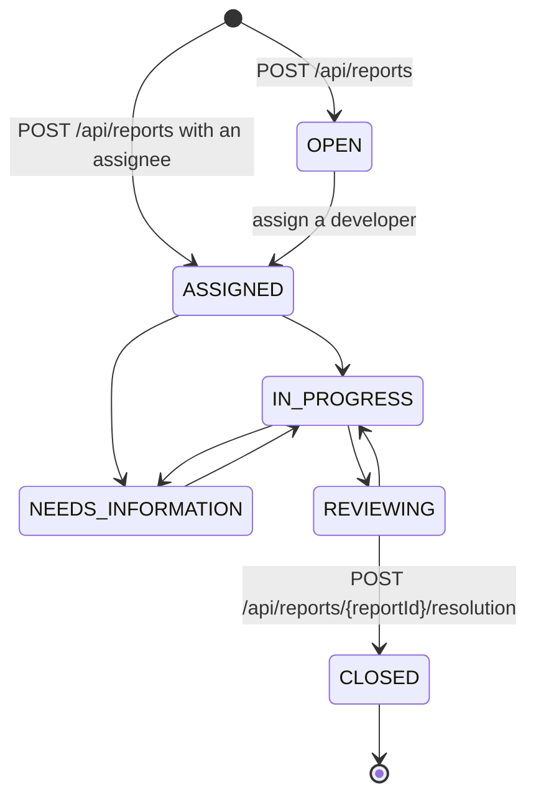
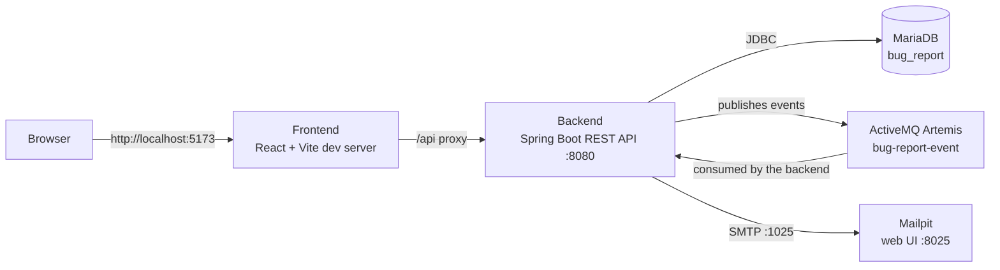
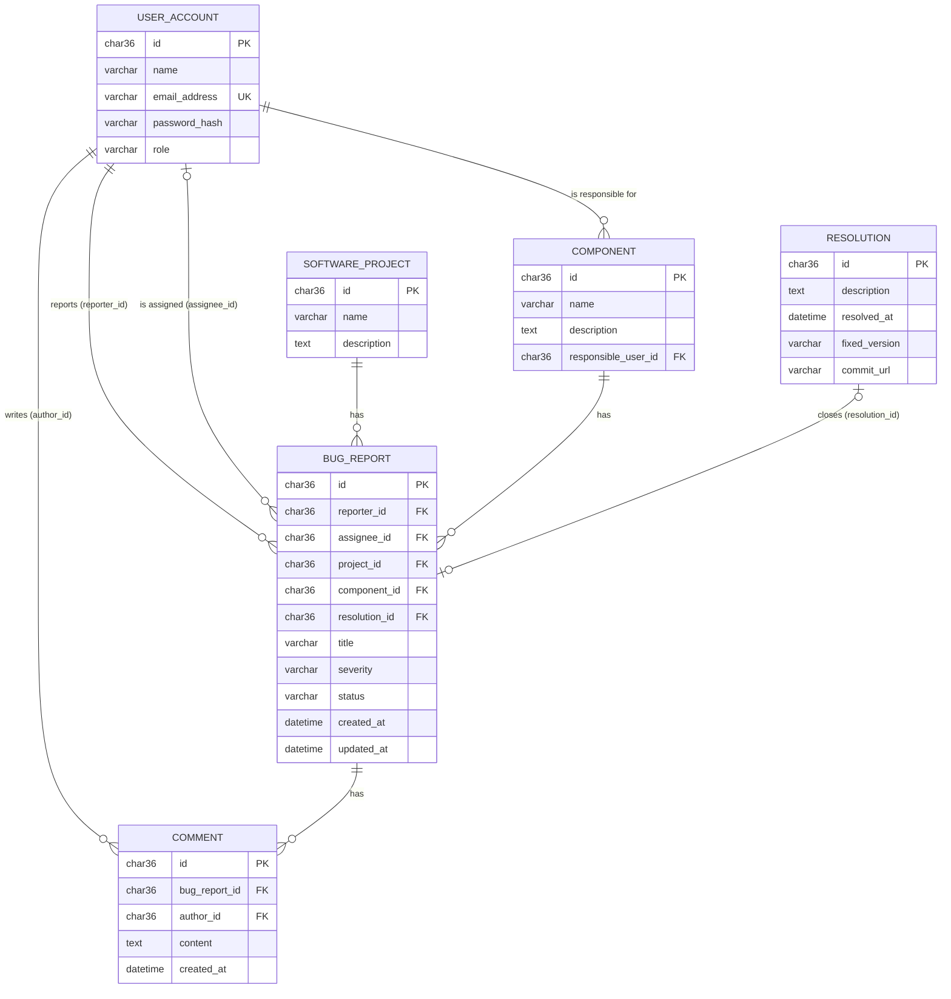
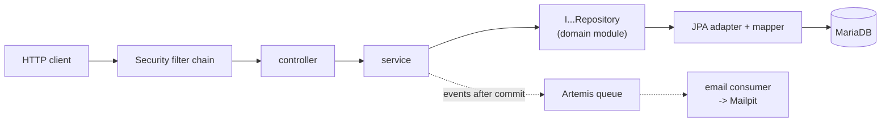
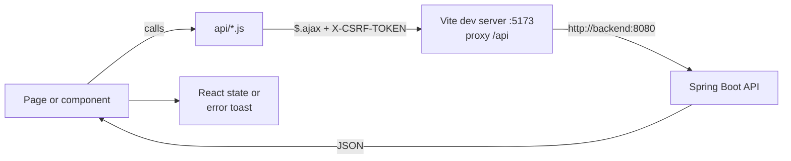
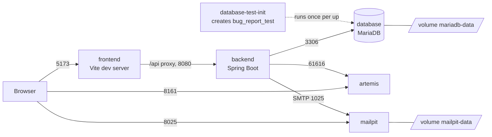

# Bug Report System

A minimalistic Jira-style bug tracker, built as a school project. Users file bug reports
against software projects and components, discuss them in comments, and close them with a
resolution. A Spring Boot REST API stores the data in MariaDB, and a React web client uses
that API. Changes to a report (new assignee, new status, closing) are published as events
to a message broker and sent to the people involved as emails.

## Table of contents

1. [Features](#features)
2. [Architecture overview](#architecture-overview)
3. [Tech stack](#tech-stack)
4. [Project structure](#project-structure)
5. [Domain model](#domain-model)
6. [Backend](#backend)
7. [REST API](#rest-api)
8. [API documentation](#api-documentation)
9. [Frontend](#frontend)
10. [Getting started](#getting-started)
11. [Demo credentials](#demo-credentials)
12. [Testing](#testing)
13. [Configuration reference](#configuration-reference)
14. [Known limitations](#known-limitations)
15. [Task board](#task-board)

## Features

- **Accounts and roles.** Anyone can register (new accounts get the `REPORTER` role) and sign
  in with email and password. An administrator can change roles to `DEVELOPER` or `ADMIN`.
- **Bug reports.** A signed-in user files a report with a title, severity (`LOW`, `MEDIUM`,
  `HIGH`, `CRITICAL`), project, component and optional details (description, steps to
  reproduce, expected and actual behavior, assignee). _Currently the create request fails, see
  [Known limitations](#known-limitations)._
- **Triage.** The reporter, the assignee or an admin can edit a report, change its severity
  and status, move it to another project or component, and assign it to a developer.
- **Comments.** Any signed-in user can comment on an open report. A comment can be deleted by
  its author or an admin.
- **Resolution.** A report is closed by adding a resolution (description, optional fixed
  version and commit URL). A closed report can no longer be changed or commented on.
- **Administration.** Admins and developers manage projects and components; admins manage
  user roles.
- **Email notifications.** Assigning (also when creating a report with an assignee), changing
  the status and closing a report send an email (caught by Mailpit in the development setup).

### Bug report lifecycle

A report starts as `OPEN`, or as `ASSIGNED` if it is created with an assignee. Status changes
must follow the transitions below (`EBugStatus.canTransitionTo`); anything else is rejected with
409. Setting the current status again does nothing and sends no email. `ASSIGNED` is reached only
by assigning a developer (on creation, or from `OPEN` with `PATCH /api/reports/{reportId}/assignee`),
never through the status endpoint; assigning a report that is not `OPEN` leaves its status
unchanged. `CLOSED` can only be reached from `REVIEWING` by adding a resolution, and it is final.
`REJECTED` exists in the enum but is not part of the lifecycle.



_Figure 1: Status lifecycle of a bug report (`EBugStatus`). Changing between the open statuses
uses `PATCH /api/reports/{reportId}/status`, which rejects `ASSIGNED`, `CLOSED` and disallowed transitions._

## Architecture overview

The browser talks only to the frontend dev server, which forwards `/api` requests to the
backend. The backend keeps its data in MariaDB and publishes report events to ActiveMQ
Artemis; a listener in the same application turns the events into emails sent to Mailpit.



_Figure 2: Runtime components and how they communicate. All of them run as services in
[docker-compose.yml](docker-compose.yml)._

## Tech stack

| Layer | Technology | Version |
| --- | --- | --- |
| Backend language | Java | 21 |
| Backend framework | Spring Boot (web MVC, Data JPA, Security, Validation, Artemis, Mail) | 4.1.0 |
| Build tool | Maven (multi-module) | 3.9.16 in the Docker build (no Maven wrapper in the repository) |
| Database | MariaDB | `latest` image tag (not pinned) |
| Schema migrations | Flyway | managed by Spring Boot |
| Message broker | Apache ActiveMQ Artemis | `latest-alpine` image tag (not pinned) |
| Email (development) | Mailpit | `latest` image tag (not pinned) |
| Frontend framework | React, React Router | 19.2 / 8.3 |
| Frontend UI and HTTP | Bootstrap, Bootstrap Icons, jQuery (`$.ajax`) | 5.3 / 1.13 / 4.0 |
| Frontend build tool | Vite | 8.2 |
| Frontend runtime | Node.js (in the Docker image) | 24.18.0 |
| Containers | Docker, Docker Compose | – |

Versions are taken from [backend/pom.xml](backend/pom.xml),
[frontend/package.json](frontend/package.json) (the `^` ranges are minimums; the exact
versions are in `package-lock.json`), the Dockerfiles and
[docker-compose.yml](docker-compose.yml).

## Project structure

```text
bug-report-system/
├── backend/                      Maven parent project (Java 21, Spring Boot 4.1.0)
│   ├── bug-report-domain/        Plain Java domain classes, enums and repository interfaces
│   ├── bug-report-api/           Spring Boot application: REST controllers, services,
│   │                             security, persistence (JPA), messaging, Flyway migrations, tests
│   └── Dockerfile                Builds and runs the backend image
├── frontend/                     React application (Vite)
│   └── src/
│       ├── api/                  Modules that send the REST requests
│       ├── components/           Reusable UI components and route guards
│       └── pages/                Application pages built from the components
├── database/init/                SQL that MariaDB runs on first start (creates the test database)
├── docs/                         Design images, Excalidraw sketches of the UI, and the OpenAPI spec
│   └── openapi/                  Generated openapi.yaml plus guides to generate and validate it
├── .github/workflows/            CI check that the committed OpenAPI spec is up to date
├── redocly.yaml                  Lint rules for the OpenAPI spec
├── docker-compose.yml            Development environment: backend, frontend, MariaDB, Artemis, Mailpit
├── build-backend.sh              Builds the backend with Maven
├── run-backend.sh                Starts the backend with Maven
├── db-entity-description.txt     Original plain-text sketch of the database tables
├── bug-report-system.json        Project task board data
└── Oddities.md                   Inconsistencies found while documenting the code
```

## Domain model

The system stores six entities. A seventh class, `Attachment`, exists in the domain module but
is not persisted or exposed, so attachments are not a working feature yet.



_Figure 3: Database tables and their relations, as created by
[V1__Base.sql](backend/bug-report-api/src/main/resources/db/migration/V1__Base.sql). Text columns
of `bug_report` (`description`, `steps_to_reproduce`, `expected_behavior`, `actual_behavior`) and the
unused `archived_at` columns are left out of the diagram._

| Enum | Values |
| --- | --- |
| `EUserRole` | `REPORTER`, `DEVELOPER`, `ADMIN` |
| `EBugSeverity` | `LOW`, `MEDIUM`, `HIGH`, `CRITICAL` |
| `EBugStatus` | `OPEN`, `ASSIGNED`, `IN_PROGRESS`, `NEEDS_INFORMATION`, `REVIEWING`, `REJECTED`, `CLOSED` |

Field descriptions, business rules and class diagrams are in the
[domain model reference](docs/domain-model.md).

## Backend

The backend is a Maven multi-module project in [backend/](backend/) (Java 21, Spring Boot 4.1.0):

- **`bug-report-domain`**: plain Java domain classes, enums and repository interfaces, without
  any framework dependency.
- **`bug-report-api`**: the Spring Boot application with the REST controllers, services,
  security, persistence and messaging. It depends on the domain module.

Packages of `bug-report-api` (under `com.ramy.bugreport`):

| Package | Purpose |
| --- | --- |
| `controller` | REST endpoints; translate HTTP to service calls |
| `dto` | Request and response records with validation annotations |
| `service` | Business rules, transactions and ownership checks (`@PreAuthorize`) |
| `component` | Authorizers used by `@PreAuthorize` expressions |
| `security` | Session login, roles by URL, CSRF, CORS, 401 and 403 handlers |
| `exception` | Exceptions and their translation into JSON error responses |
| `persistence` | JPA entities, mappers and the repository implementations |
| `messaging` | Events, publisher (Artemis) and the email-sending consumer |



_Figure 4: Layers of the backend. Services depend only on repository interfaces from the domain
module; the persistence package implements them with Spring Data JPA._

**Database.** MariaDB (database `bug_report`, user `bug_report`), not an in-memory database. The
schema is created by Flyway from
[V1__Base.sql](backend/bug-report-api/src/main/resources/db/migration/V1__Base.sql). Data is kept
in the `mariadb-data` Docker volume, so it survives restarts.

**Demo data.** On startup, `BugReportApplication.seedData` fills an empty database (it does
nothing if a user already exists) with 4 users, 1 project, 2 components, 3 bug reports and 3
comments. See [Demo credentials](#demo-credentials).

**Notifications.** Assigning a report, changing its status and closing it publish an event to
the Artemis queue `bug-report-event` after the transaction commits. A listener in the same
application sends an email through SMTP (Mailpit in development). If sending fails, the API
request is not affected.

Details, including the security setup, error handling, the messaging and close-report sequence
diagram, and the startup and seeding flow, are in the [backend reference](docs/backend.md).

## REST API

The backend serves a JSON REST API under `/api` (default port 8080). Fields are camelCase.
Authentication is a session cookie from `POST /api/auth/login`. Every `POST`, `PATCH` and
`DELETE` request, including login, must send the CSRF token from `GET /api/csrf` in the
`X-CSRF-TOKEN` header. Errors have the body `{"message": "..."}` with status 400, 401, 403, 404
or 409. URLs that are not explicitly allowed answer 403.

"Owner" below means: the report's reporter or assignee (an admin is always allowed).

| Method | Path | Purpose | Access |
| --- | --- | --- | --- |
| GET | `/api/csrf` | Get the CSRF token | Public |
| POST | `/api/auth/login` | Sign in (form fields `username` = email, `password`) | Public |
| POST | `/api/auth/logout` | Sign out | Signed in |
| GET | `/api/auth/me` | Current user | Signed in |
| POST | `/api/accounts` | Register (role `REPORTER`) | Public |
| GET | `/api/accounts` | List all accounts | Admin |
| GET | `/api/accounts/developers` | List developers | Signed in |
| GET | `/api/accounts/users?search=` | Search users by name | Admin, developer |
| PATCH | `/api/accounts/{userId}/role` | Change a user's role | Admin |
| GET | `/api/projects` | List projects | Signed in |
| POST | `/api/projects` | Create a project | Admin |
| PATCH | `/api/projects/{projectId}/name` | Rename a project | Admin, developer |
| PATCH | `/api/projects/{projectId}/description` | Change a project's description | Admin, developer |
| GET | `/api/components` | List components | Signed in |
| POST | `/api/components` | Create a component | Admin, developer |
| PATCH | `/api/components/{componentId}/name` | Rename a component | Admin, developer |
| PATCH | `/api/components/{componentId}/description` | Change a component's description | Admin, developer |
| PATCH | `/api/components/{componentId}/responsibleUserId` | Change the responsible user | Admin, developer |
| GET | `/api/reports` | List all reports (brief) | Signed in |
| GET | `/api/reports/{reportId}` | Get one report in full | Signed in |
| GET | `/api/reports/reported` | Reports filed by me | Signed in |
| GET | `/api/reports/assigned` | Reports assigned to me | Signed in |
| GET | `/api/reports/status-transitions` | Statuses that can be chosen next, by current status | Signed in |
| POST | `/api/reports` | File a report (currently fails, see below) | Signed in |
| POST | `/api/reports/{reportId}/resolution` | Close a report | Owner or admin |
| PATCH | `/api/reports/{reportId}/assignee` | Assign a developer | Owner or admin |
| PATCH | `/api/reports/{reportId}/severity` | Change severity | Owner or admin |
| PATCH | `/api/reports/{reportId}/status` | Change status (not to `ASSIGNED` or `CLOSED`) | Owner or admin |
| PATCH | `/api/reports/{reportId}/project` | Move to another project | Owner or admin |
| PATCH | `/api/reports/{reportId}/component` | Move to another component | Owner or admin |
| PATCH | `/api/reports/{reportId}/description` | Replace the description | Owner or admin |
| PATCH | `/api/reports/{reportId}/steps-to-reproduce` | Replace the steps to reproduce | Owner or admin |
| PATCH | `/api/reports/{reportId}/expected-behavior` | Replace the expected behavior | Owner or admin |
| PATCH | `/api/reports/{reportId}/actual-behavior` | Replace the actual behavior | Owner or admin |
| GET | `/api/comments?reportId=...` | List comments of a report | Signed in |
| POST | `/api/comments` | Add a comment (`reportId` in the body) | Signed in |
| DELETE | `/api/comments/{commentId}` | Delete a comment | Author or admin |

> **Known issue:** `POST /api/reports` currently answers 409 for valid input, because the
> service never sets `updatedAt` and the database column `bug_report.updated_at` is `NOT NULL`
> (verified against the running backend). See [Known limitations](#known-limitations).

Request and response examples, validation rules, error cases and sequence diagrams for the sign-in
and create-report flows are in the [API reference](docs/api-reference.md). The machine-readable
specification is described in [API documentation](#api-documentation).

## API documentation

The API is documented with an OpenAPI 3.1 specification, generated from annotations in the backend code.

- **Swagger UI:** <http://localhost:8080/swagger-ui.html> while the backend runs (no sign-in is needed to view it).
  "Try it out" on changing requests needs a session and a CSRF token, see the steps in the
  [validation guide](docs/openapi/VALIDATION.md#3-open-swagger-ui).
- **Committed spec:** [docs/openapi/openapi.yaml](docs/openapi/openapi.yaml). The running backend also serves it at
  <http://localhost:8080/v3/api-docs.yaml>.
- **The annotations are the source of truth.** The spec is generated from the controller and DTO annotations
  (`@Operation`, `@ApiResponse`, `@Schema`, ...), so never edit the YAML by hand: the next generation overwrites it.
  A CI check fails if the committed spec no longer matches the code.

The endpoint table above and the spec list the same 36 operations. The spec adds request and response
schemas, status codes and examples. It documents the intended behavior, so the known issue with
`POST /api/reports` (see [Known limitations](#known-limitations)) also applies to what Swagger UI shows.

How to regenerate the spec: [docs/openapi/GENERATE.md](docs/openapi/GENERATE.md).
How to check that it is correct: [docs/openapi/VALIDATION.md](docs/openapi/VALIDATION.md).

## Frontend

A single-page React application in [frontend/](frontend/), built with Vite, styled with
Bootstrap and using React Router for navigation. Requests to the backend are sent with jQuery
`$.ajax`. Source layout (`frontend/src/`):

- `api/`: one module per resource (`bug-report.js`, `comment.js`, `project.js`, ...); each
  function returns the jQuery promise of one REST call.
- `components/`: reusable UI, the auth context and provider, and the route guards.
- `pages/`: one component per route.

| Route | Page | Access |
| --- | --- | --- |
| `/login` | Sign-in form | Public |
| `/` | Report list with quick filters ("Reported by me", "Assigned to me") and a "Create new" dialog | Signed in |
| `/reports/:id` | Report detail: inline editing, comments, closing with a resolution | Signed in |
| `/admin/projects` | Project administration | Admin, developer |
| `/admin/components` | Component administration | Admin, developer |
| `/admin/users` | User roles | Admin |



_Figure 5: How the frontend talks to the API. The browser only contacts the Vite server, which
forwards `/api` requests to the backend, so no cross-origin requests happen in development._

The current user is loaded with `GET /api/auth/me` when the app starts and shared through
`AuthContext`. `ProtectedRoute`, `DeveloperRoute` and `AdminRoute` redirect users who lack access;
the backend enforces the same rules. The CSRF token is fetched from `GET /api/csrf` and sent with
every request that changes data.

There are no frontend tests. `npm ci`, `npm run build` and `npm run lint` pass. The frontend is
run as a Vite development server; the Docker image does not build a production bundle.

More details, including the route and session diagrams, are in the
[frontend reference](docs/frontend.md).

## Getting started

### Prerequisites

| To do this | You need |
| --- | --- |
| Run everything (recommended) | Docker with the Compose plugin |
| Build and test the backend on your machine | JDK 21 and Maven (3.9 is used in the Docker build; 3.8.7 was also tested), plus Docker for the database |
| Build or lint the frontend on your machine | Node.js 24 and npm |

```shell
git clone <repository-url>
cd bug-report-system
```

### Run everything with Docker Compose

```shell
docker compose up --build
```

This builds the backend and frontend images and starts five services plus the one-shot `database-test-init` job. The first start seeds the
demo data (see [Demo credentials](#demo-credentials)).



_Figure 6: Docker Compose services and volumes. Published on the host: 5173 (frontend), 8080
(backend), 3306 (database), 8025 (Mailpit web UI) and 8161 (Artemis console). Artemis port 61616
and SMTP port 1025 exist only inside the Compose network._

| URL | What |
| --- | --- |
| <http://localhost:5173> | Web application (sign in with a [demo account](#demo-credentials)) |
| <http://localhost:8080/api/csrf> | Backend API (see [REST API](#rest-api)) |
| <http://localhost:8025> | Mailpit: the notification emails sent by the backend |
| <http://localhost:8161> | Artemis console (user `artemis`, password `artemis`) |
| `localhost:3306` | MariaDB (database `bug_report`, user `bug_report`, password `bug_report`) |

The backend starts after the database is healthy and Artemis has started. Stop the services with
`docker compose down`. The database and Mailpit data are kept in Docker volumes; to delete them and
start again with fresh demo data, run `docker compose down -v`.

To start only the infrastructure (for example to work on the backend), run
`docker compose up -d database mailpit artemis`.

### Run the backend on your machine

The backend needs MariaDB, so start the database first:

```shell
docker compose up -d database mailpit artemis
```

`application.yml` uses the Compose host names `database`, `artemis` and `mailpit`, which do not
resolve on your machine. Running `./run-backend.sh` as is therefore fails with
`Socket fail to connect to database`. Override the database URL with a Spring environment
variable:

```shell
cd backend
mvn clean install -DskipTests
cd bug-report-api
SPRING_DATASOURCE_URL=jdbc:mariadb://localhost:3306/bug_report mvn spring-boot:run
```

The API is then available at <http://localhost:8080>. **Limitation:** Artemis port 61616 and
SMTP port 1025 are not published by `docker-compose.yml`, so the backend cannot reach them from
your machine. Everything works except the notification emails, and the log shows Artemis
connection errors. To get emails, run the backend through Docker Compose instead.

`mvn spring-boot:run -pl bug-report-api -am` from the `backend` directory does **not** work: it
fails with `Unable to find a suitable main class`, because the plugin also runs on the parent
project. `mvn install` in `backend` first, then run from `bug-report-api` as shown above.

### Scripts

Both scripts must be run from the repository root.

| Script | What it does |
| --- | --- |
| `./build-backend.sh` | `mvn clean install` in `backend/`: compiles both modules, **runs the tests** (which need MariaDB, see [Testing](#testing)) and installs the modules into the local Maven repository |
| `./run-backend.sh` | `mvn spring-boot:run` in `backend/bug-report-api` (see the host-name limitation above) |
| `./run-backend.sh build` | Runs `build-backend.sh` first, then starts the backend |

### Frontend on your machine

`npm run dev` on your machine cannot reach a backend: the Vite proxy in
[vite.config.js](frontend/vite.config.js) points to `http://backend:8080`, a host name that exists
only inside the Compose network. Run the frontend with Docker Compose (`docker compose up
--build frontend backend` starts it with the backend and database). These commands work on the
host:

```shell
cd frontend
npm ci
npm run build
npm run lint
```

## Demo credentials

On the first start with an empty database, the backend creates these accounts (see
`BugReportApplication.seedData`), together with one project, two components, three bug reports
and three comments.

| Role | Email | Password |
| --- | --- | --- |
| Administrator | `admin@bugreport.local` | `Admin123!` |
| Backend developer | `developer@bugreport.local` | `Developer123!` |
| Frontend developer | `frontend@bugreport.local` | `Developer123!` |
| Reporter | `reporter@bugreport.local` | `Reporter123!` |

> **Warning:** these accounts are development fixtures only. Passwords are stored in the
> database as BCrypt hashes, but the plain-text demo passwords are hard-coded in the source code
> and written to the application log at startup.
>
> The previous README listed `Frontend123!` for `frontend@bugreport.local`. That is wrong: the
> seed code gives this account the developer password, and signing in with `Frontend123!` answers
> 401 (verified).

## Testing

The backend has 95 automated tests (JUnit 5, Mockito, Spring MockMvc). There are no frontend
tests.

| Kind | Tests | What is covered |
| --- | --- | --- |
| Service unit tests (Mockito, no Spring) | 58 | Business rules of `BugReportService` (28), `UserAccountService` (9), `CommentService` (9), `ComponentService` (7) and `SoftwareProjectService` (5) |
| Controller tests (standalone MockMvc, mocked services) | 25 | Routes, status codes and request handling of the five controllers |
| Integration tests (`@SpringBootTest`, profile `test`, classes named `*IT`) | 12 | `PersistenceIT` (6): repositories and mapping against MariaDB; `UserRoleSecurityIT` (6): role rules on the URLs with a real security configuration |

The unit and controller tests run with `mvn test` and need nothing. The integration tests run
only in `mvn verify` (and `mvn install`), through the Failsafe plugin, and use the database
`bug_report_test` on `localhost:3306`
([application-test.yml](backend/bug-report-api/src/test/resources/application-test.yml)), so start
the database first.

```shell
cd backend
mvn test                                                    # unit and controller tests, no database needed

docker compose up -d database database-test-init            # needed for the integration tests
mvn verify                                                  # all tests
mvn test -pl bug-report-api -am -Dtest=BugReportServiceTest -Dsurefire.failIfNoSpecifiedTests=false   # one unit test class
mvn verify -pl bug-report-api -am -Dit.test=PersistenceIT -Dtest=NoSuchTest -Dsurefire.failIfNoSpecifiedTests=false -Dfailsafe.failIfNoSpecifiedTests=false   # one integration test class
```

`./build-backend.sh` runs `mvn clean install`, so it also runs the integration tests. To build without them, use
`mvn clean install -DskipTests` in `backend/`.

Notes:

- `bug_report_test` is created by the one-shot `database-test-init` service, which runs
  [database/init](database/init/01-create-test-database.sql) against the running database and then
  exits. The database image itself runs that script only on an empty volume, so this service is what
  also fixes volumes created earlier. It is safe to run repeatedly.

- The test log contains Artemis connection errors (`AMQ219007`), because the broker host is not
  reachable from your machine. The tests still pass.
- The tests do not catch the `POST /api/reports` failure described in
  [Known limitations](#known-limitations): the service tests use mocked repositories, so the
  `NOT NULL` column is never hit.

## Configuration reference

The backend is configured in
[application.yml](backend/bug-report-api/src/main/resources/application.yml). Any property can be
overridden with a Spring environment variable (dots become underscores, upper case), for example
`SPRING_DATASOURCE_URL`; this was verified for the datasource URL.

| Property | Default | Purpose |
| --- | --- | --- |
| `spring.datasource.url` | `jdbc:mariadb://database:3306/bug_report` | Database connection |
| `spring.datasource.username` / `password` | `bug_report` / `bug_report` | Database login |
| `spring.artemis.mode` | `native` | Connect to an Artemis broker |
| `spring.artemis.broker-url` | `tcp://artemis:61616` | Broker address |
| `spring.artemis.user` / `password` | `artemis` / `artemis` | Broker login |
| `spring.mail.host` / `port` | `mailpit` / `1025` | SMTP server for notification emails |
| `messaging.destinations.bug-report-event` | `bug-report-event` | Queue name for report events |
| `server.port` | not set, so Spring Boot's default `8080` | HTTP port of the backend |

Test profile (`application-test.yml`): `spring.datasource.url` is
`jdbc:mariadb://localhost:3306/bug_report_test`.

Values that are **hard-coded in the source** and cannot be configured:

| Value | Where |
| --- | --- |
| Allowed CORS origin `http://localhost:5173` | `SecurityConfig` |
| Email sender `no-reply@bugreport.local` | `BugReportEventConsumer` |
| Backend address `http://backend:8080` for the frontend proxy | `frontend/vite.config.js` |
| Toast display time (5 seconds) | `frontend/src/components/Toast.jsx` |

Docker Compose ([docker-compose.yml](docker-compose.yml)) sets:

| Service | Settings |
| --- | --- |
| `database` | `MARIADB_ROOT_PASSWORD=root`, `MARIADB_DATABASE=bug_report`, `MARIADB_USER=bug_report`, `MARIADB_PASSWORD=bug_report`; port 3306; volume `mariadb-data`; `./database/init` mounted read-only |
| `artemis` | `ARTEMIS_USER=artemis`, `ARTEMIS_PASSWORD=artemis`; console on 8161 |
| `mailpit` | Web UI on 8025; `MP_DATABASE=/data/mailpit.db`, `MP_MAX_MESSAGES=5000`, accepts any SMTP login; volume `mailpit-data` |
| `backend` | Port 8080; no environment variables (uses `application.yml`) |
| `frontend` | Port 5173 |

All passwords above are development defaults. Do not use them in production.

## Known limitations

Nothing below is hidden from the code; this is the honest current state. More detailed
findings are in [Oddities.md](Oddities.md).

- **Filing a new bug report fails.** `POST /api/reports` answers 409 because `updatedAt` is never
  set while `bug_report.updated_at` is `NOT NULL` (verified). The seeded demo reports work.
- **Basic authentication only.** Session cookie and CSRF token, with three fixed roles. There
  is no password policy, password reset, email verification or account lockout.
- **Demo passwords are hard-coded** and printed to the log at startup.
- **Attachments are not implemented.** An `Attachment` domain class exists, but there is no
  table, endpoint or user interface for it.
- **Every signed-in user sees every report** (no per-project visibility).
- **Hard-coded development settings.** CORS allows only `http://localhost:5173`, and database,
  broker and mail credentials are plain defaults in `application.yml`.
- **Docker images are not pinned** for MariaDB, Artemis and Mailpit.
- **The frontend runs as a Vite development server**, not as a production build.
- **No license file** is part of the repository.

## Task board

The project's to-do list is kept in [bug-report-system.json](bug-report-system.json), not in an
external tracker. It is displayed with a small, vibe-coded kanban board of my own:
[ramys2/kanban-board](https://github.com/ramys2/kanban-board). It is a separate project, not
part of this repository, and it is not needed to build or run the bug report system.

According to its README, the board is plain HTML, CSS and JavaScript with no backend and no build
step: open `index.html` in a modern desktop browser, then use **Load** to import
`bug-report-system.json`. **Save JSON** downloads the board again, and the current board is also
kept automatically in the browser's `localStorage`. To share changes, replace the JSON file in
this repository with the saved one.

The JSON file has this structure (version 1): a board `name` and a list of `columns` (currently
"To Do", "In progress" and "Done"), each with a list of `tasks`. A task has an `id`, a `title`, a
`description` and a `color`.

```json
{
  "version": 1,
  "name": "Bug Report System",
  "columns": [
    {
      "id": "column-...",
      "name": "To Do",
      "tasks": [
        { "id": "task-...", "title": "[Bug] Fix ...", "description": "...", "color": "#c4524f" }
      ]
    }
  ]
}
```

Tasks that came from [Oddities.md](Oddities.md) have a category in the title: `[Bug]`,
`[Verify]`, `[Design]`, `[Refactor]`, `[UX]`, `[Security]` or `[Infra]`.
