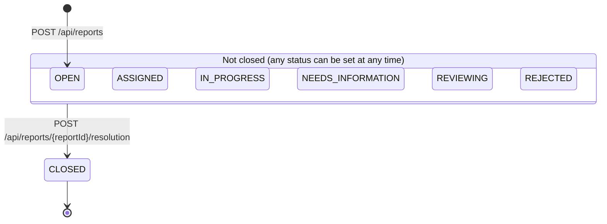
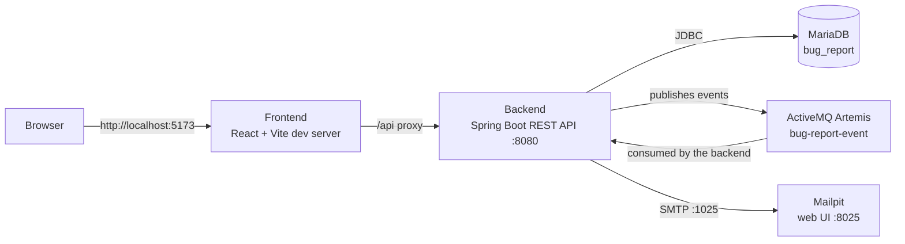

# Bug Report System

A minimalistic Jira-style bug tracker, built as a school project. Users file bug reports
against software projects and components, discuss them in comments, and close them with a
resolution. A Spring Boot REST API stores the data in MariaDB, and a React web client uses
that API. Changes to a report (new assignee, new status, closing) are published as events
to a message broker and sent to the people involved as emails.

> **Status:** work in progress. Sections marked _Coming soon_ are added step by step.

## Table of contents

1. [Features](#features)
2. [Architecture overview](#architecture-overview)
3. [Tech stack](#tech-stack)
4. [Project structure](#project-structure)
5. [Domain model](#domain-model) _(coming soon)_
6. [Backend](#backend) _(coming soon)_
7. [REST API](#rest-api) _(coming soon)_
8. [Frontend](#frontend) _(coming soon)_
9. [Getting started](#getting-started) _(coming soon)_
10. [Demo credentials](#demo-credentials)
11. [Testing](#testing) _(coming soon)_
12. [Configuration reference](#configuration-reference) _(coming soon)_
13. [Known limitations](#known-limitations)

## Features

- **Accounts and roles.** Anyone can register (new accounts get the `REPORTER` role) and sign
  in with email and password. An administrator can change roles to `DEVELOPER` or `ADMIN`.
- **Bug reports.** A signed-in user files a report with a title, severity (`LOW`, `MEDIUM`,
  `HIGH`, `CRITICAL`), project, component and optional details (description, steps to
  reproduce, expected and actual behavior, assignee).
- **Triage.** The reporter, the assignee or an admin can edit a report, change its severity
  and status, move it to another project or component, and assign it to a developer.
- **Comments.** Any signed-in user can comment on an open report. A comment can be deleted by
  its author or an admin.
- **Resolution.** A report is closed by adding a resolution (description, optional fixed
  version and commit URL). A closed report can no longer be changed or commented on.
- **Administration.** Admins and developers manage projects and components; admins manage
  user roles.
- **Email notifications.** Assigning, changing the status and closing a report send an email
  (caught by Mailpit in the development setup).

### Bug report lifecycle

A report starts as `OPEN`. The code applies **no transition rules** between the open
statuses: any status except `CLOSED` can be set at any time, and assigning a developer does not
change the status by itself. `CLOSED` can only be reached by adding a resolution, and it is
final.



_Figure 1: Status lifecycle of a bug report (`EBugStatus`). Changing between the open statuses
uses `PATCH /api/reports/{reportId}/status`, which rejects `CLOSED`._

## Architecture overview

The browser talks only to the frontend dev server, which forwards `/api` requests to the
backend. The backend keeps its data in MariaDB and publishes report events to ActiveMQ
Artemis; a listener in the same application turns the events into emails sent to Mailpit.



_Figure 2: Runtime components and how they communicate. All of them run as services in
[docker-compose.yml](docker-compose.yml)._

## Tech stack

| Layer | Technology | Version |
| --- | --- | --- |
| Backend language | Java | 21 |
| Backend framework | Spring Boot (web MVC, Data JPA, Security, Validation, Artemis, Mail) | 4.1.0 |
| Build tool | Maven (multi-module) | 3.9.16 in the Docker build (no Maven wrapper in the repository) |
| Database | MariaDB | `latest` image tag (not pinned) |
| Schema migrations | Flyway | managed by Spring Boot |
| Message broker | Apache ActiveMQ Artemis | `latest-alpine` image tag (not pinned) |
| Email (development) | Mailpit | `latest` image tag (not pinned) |
| Frontend framework | React, React Router | 19.2 / 8.3 |
| Frontend UI and HTTP | Bootstrap, Bootstrap Icons, jQuery (`$.ajax`) | 5.3 / 1.13 / 4.0 |
| Frontend build tool | Vite | 8.2 |
| Frontend runtime | Node.js (in the Docker image) | 24.18.0 |
| Containers | Docker, Docker Compose | – |

Versions are taken from [backend/pom.xml](backend/pom.xml),
[frontend/package.json](frontend/package.json) (the `^` ranges are minimums; the exact
versions are in `package-lock.json`), the Dockerfiles and
[docker-compose.yml](docker-compose.yml).

## Project structure

```text
bug-report-system/
├── backend/                      Maven parent project (Java 21, Spring Boot 4.1.0)
│   ├── bug-report-domain/        Plain Java domain classes, enums and repository interfaces
│   ├── bug-report-api/           Spring Boot application: REST controllers, services,
│   │                             security, persistence (JPA), messaging, Flyway migrations, tests
│   └── Dockerfile                Builds and runs the backend image
├── frontend/                     React application (Vite)
│   └── src/
│       ├── api/                  Modules that send the REST requests
│       ├── components/           Reusable UI components and route guards
│       └── pages/                Application pages built from the components
├── database/init/                SQL that MariaDB runs on first start (creates the test database)
├── docs/                         Design images and Excalidraw sketches of the UI
├── docker-compose.yml            Development environment: backend, frontend, MariaDB, Artemis, Mailpit
├── build-backend.sh              Builds the backend with Maven
├── run-backend.sh                Starts the backend with Maven
├── db-entity-description.txt     Original plain-text sketch of the database tables
├── bug-report-system.json        Project task board data
└── Oddities.md                   Inconsistencies found while documenting the code
```

## Domain model

_Coming soon._

## Backend

_Coming soon._

## REST API

_Coming soon._

## Frontend

_Coming soon._

## Getting started

_Coming soon._

## Demo credentials

On the first start with an empty database, the backend creates these accounts (see
`BugReportApplication.seedData`), together with one project, two components, three bug reports
and three comments.

| Role | Email | Password |
| --- | --- | --- |
| Administrator | `admin@bugreport.local` | `Admin123!` |
| Backend developer | `developer@bugreport.local` | `Developer123!` |
| Frontend developer | `frontend@bugreport.local` | `Frontend123!` |
| Reporter | `reporter@bugreport.local` | `Reporter123!` |

> **Warning:** these accounts are development fixtures only. Passwords are stored in the
> database as BCrypt hashes, but the plain-text demo passwords are hard-coded in the source code
> and written to the application log at startup.
>
> TODO(verify): the previous README listed `Frontend123!` for `frontend@bugreport.local`, but
> `BugReportApplication.seedData` creates that account with the developer password
> (`Developer123!`). This is checked against the running application in the getting-started
> iteration.

## Testing

_Coming soon._

## Configuration reference

_Coming soon._

## Known limitations

Nothing below is hidden from the code; this is the honest current state. More detailed
findings are in [Oddities.md](Oddities.md).

- **Basic authentication only.** Session cookie and CSRF token, with three fixed roles. There
  is no password policy, password reset, email verification or account lockout.
- **Demo passwords are hard-coded** and printed to the log at startup.
- **No status transition rules.** Any open status can be set at any time; only `CLOSED` is
  special.
- **Attachments are not implemented.** An `Attachment` domain class exists, but there is no
  table, endpoint or user interface for it.
- **Every signed-in user sees every report** (no per-project visibility).
- **Hard-coded development settings.** CORS allows only `http://localhost:5173`, and database,
  broker and mail credentials are plain defaults in `application.yml`.
- **Docker images are not pinned** for MariaDB, Artemis and Mailpit.
- **The frontend runs as a Vite development server**, not as a production build.
- **No OpenAPI specification exists yet.**
- **No license file** is part of the repository.
