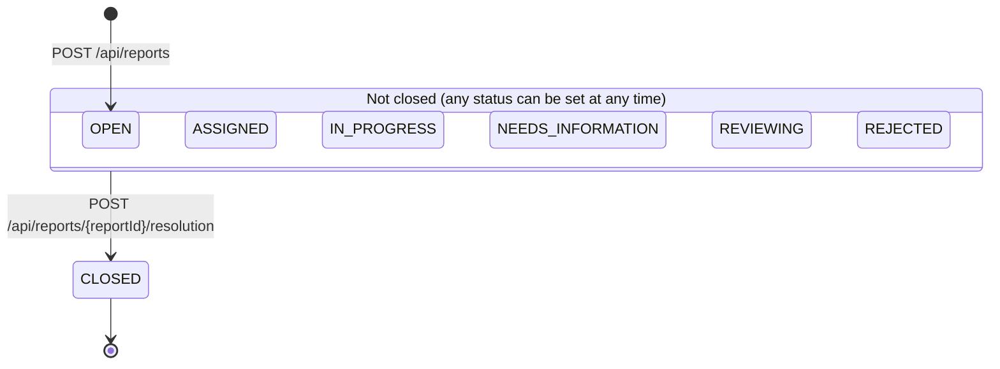
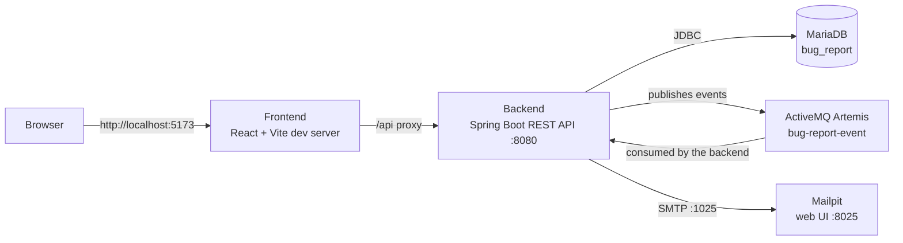
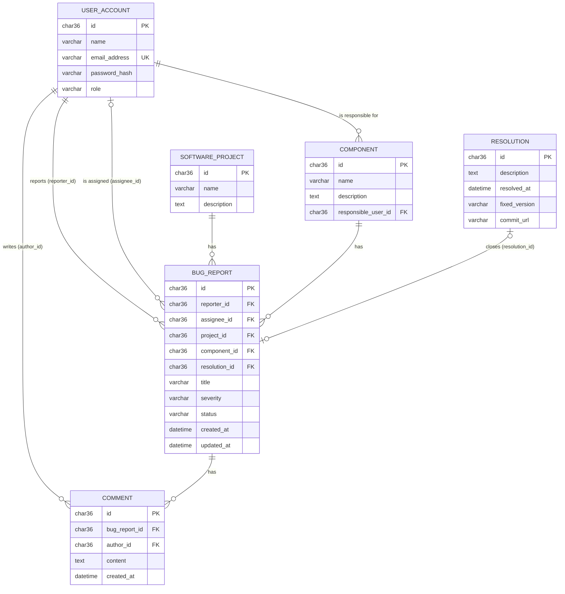
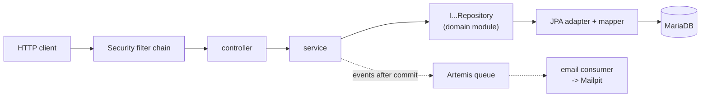
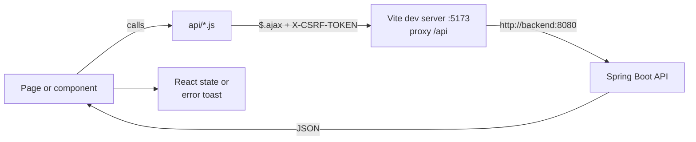

# Bug Report System

A minimalistic Jira-style bug tracker, built as a school project. Users file bug reports
against software projects and components, discuss them in comments, and close them with a
resolution. A Spring Boot REST API stores the data in MariaDB, and a React web client uses
that API. Changes to a report (new assignee, new status, closing) are published as events
to a message broker and sent to the people involved as emails.

> **Status:** work in progress. Sections marked _Coming soon_ are added step by step.

## Table of contents

1. [Features](#features)
2. [Architecture overview](#architecture-overview)
3. [Tech stack](#tech-stack)
4. [Project structure](#project-structure)
5. [Domain model](#domain-model)
6. [Backend](#backend)
7. [REST API](#rest-api)
8. [Frontend](#frontend)
9. [Getting started](#getting-started) _(coming soon)_
10. [Demo credentials](#demo-credentials)
11. [Testing](#testing) _(coming soon)_
12. [Configuration reference](#configuration-reference) _(coming soon)_
13. [Known limitations](#known-limitations)

## Features

- **Accounts and roles.** Anyone can register (new accounts get the `REPORTER` role) and sign
  in with email and password. An administrator can change roles to `DEVELOPER` or `ADMIN`.
- **Bug reports.** A signed-in user files a report with a title, severity (`LOW`, `MEDIUM`,
  `HIGH`, `CRITICAL`), project, component and optional details (description, steps to
  reproduce, expected and actual behavior, assignee). _Currently the create request fails, see
  [Known limitations](#known-limitations)._
- **Triage.** The reporter, the assignee or an admin can edit a report, change its severity
  and status, move it to another project or component, and assign it to a developer.
- **Comments.** Any signed-in user can comment on an open report. A comment can be deleted by
  its author or an admin.
- **Resolution.** A report is closed by adding a resolution (description, optional fixed
  version and commit URL). A closed report can no longer be changed or commented on.
- **Administration.** Admins and developers manage projects and components; admins manage
  user roles.
- **Email notifications.** Assigning, changing the status and closing a report send an email
  (caught by Mailpit in the development setup).

### Bug report lifecycle

A report starts as `OPEN`. The code applies **no transition rules** between the open
statuses: any status except `CLOSED` can be set at any time, and assigning a developer does not
change the status by itself. `CLOSED` can only be reached by adding a resolution, and it is
final.



_Figure 1: Status lifecycle of a bug report (`EBugStatus`). Changing between the open statuses
uses `PATCH /api/reports/{reportId}/status`, which rejects `CLOSED`._

## Architecture overview

The browser talks only to the frontend dev server, which forwards `/api` requests to the
backend. The backend keeps its data in MariaDB and publishes report events to ActiveMQ
Artemis; a listener in the same application turns the events into emails sent to Mailpit.



_Figure 2: Runtime components and how they communicate. All of them run as services in
[docker-compose.yml](docker-compose.yml)._

## Tech stack

| Layer | Technology | Version |
| --- | --- | --- |
| Backend language | Java | 21 |
| Backend framework | Spring Boot (web MVC, Data JPA, Security, Validation, Artemis, Mail) | 4.1.0 |
| Build tool | Maven (multi-module) | 3.9.16 in the Docker build (no Maven wrapper in the repository) |
| Database | MariaDB | `latest` image tag (not pinned) |
| Schema migrations | Flyway | managed by Spring Boot |
| Message broker | Apache ActiveMQ Artemis | `latest-alpine` image tag (not pinned) |
| Email (development) | Mailpit | `latest` image tag (not pinned) |
| Frontend framework | React, React Router | 19.2 / 8.3 |
| Frontend UI and HTTP | Bootstrap, Bootstrap Icons, jQuery (`$.ajax`) | 5.3 / 1.13 / 4.0 |
| Frontend build tool | Vite | 8.2 |
| Frontend runtime | Node.js (in the Docker image) | 24.18.0 |
| Containers | Docker, Docker Compose | – |

Versions are taken from [backend/pom.xml](backend/pom.xml),
[frontend/package.json](frontend/package.json) (the `^` ranges are minimums; the exact
versions are in `package-lock.json`), the Dockerfiles and
[docker-compose.yml](docker-compose.yml).

## Project structure

```text
bug-report-system/
├── backend/                      Maven parent project (Java 21, Spring Boot 4.1.0)
│   ├── bug-report-domain/        Plain Java domain classes, enums and repository interfaces
│   ├── bug-report-api/           Spring Boot application: REST controllers, services,
│   │                             security, persistence (JPA), messaging, Flyway migrations, tests
│   └── Dockerfile                Builds and runs the backend image
├── frontend/                     React application (Vite)
│   └── src/
│       ├── api/                  Modules that send the REST requests
│       ├── components/           Reusable UI components and route guards
│       └── pages/                Application pages built from the components
├── database/init/                SQL that MariaDB runs on first start (creates the test database)
├── docs/                         Design images and Excalidraw sketches of the UI
├── docker-compose.yml            Development environment: backend, frontend, MariaDB, Artemis, Mailpit
├── build-backend.sh              Builds the backend with Maven
├── run-backend.sh                Starts the backend with Maven
├── db-entity-description.txt     Original plain-text sketch of the database tables
├── bug-report-system.json        Project task board data
└── Oddities.md                   Inconsistencies found while documenting the code
```

## Domain model

The system stores six entities. A seventh class, `Attachment`, exists in the domain module but
is not persisted or exposed, so attachments are not a working feature yet.



_Figure 3: Database tables and their relations, as created by
[V1__Base.sql](backend/bug-report-api/src/main/resources/db/migration/V1__Base.sql). Text columns
of `bug_report` (`description`, `steps_to_reproduce`, `expected_behavior`, `actual_behavior`) and the
unused `archived_at` columns are left out of the diagram._

| Enum | Values |
| --- | --- |
| `EUserRole` | `REPORTER`, `DEVELOPER`, `ADMIN` |
| `EBugSeverity` | `LOW`, `MEDIUM`, `HIGH`, `CRITICAL` |
| `EBugStatus` | `OPEN`, `ASSIGNED`, `IN_PROGRESS`, `NEEDS_INFORMATION`, `REVIEWING`, `REJECTED`, `CLOSED` |

Field descriptions, business rules and class diagrams are in the
[domain model reference](docs/domain-model.md).

## Backend

The backend is a Maven multi-module project in [backend/](backend/) (Java 21, Spring Boot 4.1.0):

- **`bug-report-domain`**: plain Java domain classes, enums and repository interfaces, without
  any framework dependency.
- **`bug-report-api`**: the Spring Boot application with the REST controllers, services,
  security, persistence and messaging. It depends on the domain module.

Packages of `bug-report-api` (under `com.ramy.bugreport`):

| Package | Purpose |
| --- | --- |
| `controller` | REST endpoints; translate HTTP to service calls |
| `dto` | Request and response records with validation annotations |
| `service` | Business rules, transactions and ownership checks (`@PreAuthorize`) |
| `component` | Authorizers used by `@PreAuthorize` expressions |
| `security` | Session login, roles by URL, CSRF, CORS, 401 and 403 handlers |
| `exception` | Exceptions and their translation into JSON error responses |
| `persistence` | JPA entities, mappers and the repository implementations |
| `messaging` | Events, publisher (Artemis) and the email-sending consumer |



_Figure 4: Layers of the backend. Services depend only on repository interfaces from the domain
module; the persistence package implements them with Spring Data JPA._

**Database.** MariaDB (database `bug_report`, user `bug_report`), not an in-memory database. The
schema is created by Flyway from
[V1__Base.sql](backend/bug-report-api/src/main/resources/db/migration/V1__Base.sql). Data is kept
in the `mariadb-data` Docker volume, so it survives restarts.

**Demo data.** On startup, `BugReportApplication.seedData` fills an empty database (it does
nothing if a user already exists) with 4 users, 1 project, 2 components, 3 bug reports and 3
comments. See [Demo credentials](#demo-credentials).

**Notifications.** Assigning a report, changing its status and closing it publish an event to
the Artemis queue `bug-report-event` after the transaction commits. A listener in the same
application sends an email through SMTP (Mailpit in development). If sending fails, the API
request is not affected.

Details, including the security setup, error handling, the messaging and close-report sequence
diagram, and the startup and seeding flow, are in the [backend reference](docs/backend.md).

## REST API

The backend serves a JSON REST API under `/api` (default port 8080). Fields are camelCase.
Authentication is a session cookie from `POST /api/auth/login`. Every `POST`, `PATCH` and
`DELETE` request, including login, must send the CSRF token from `GET /api/csrf` in the
`X-CSRF-TOKEN` header. Errors have the body `{"message": "..."}` with status 400, 401, 403, 404
or 409. URLs that are not explicitly allowed answer 403.

"Owner" below means: the report's reporter or assignee (an admin is always allowed).

| Method | Path | Purpose | Access |
| --- | --- | --- | --- |
| GET | `/api/csrf` | Get the CSRF token | Public |
| POST | `/api/auth/login` | Sign in (form fields `username` = email, `password`) | Public |
| POST | `/api/auth/logout` | Sign out | Signed in |
| GET | `/api/auth/me` | Current user | Signed in |
| POST | `/api/accounts` | Register (role `REPORTER`) | Public |
| GET | `/api/accounts` | List all accounts | Admin |
| GET | `/api/accounts/developers` | List developers | Signed in |
| GET | `/api/accounts/users?search=` | Search users by name | Admin, developer |
| PATCH | `/api/accounts/{userId}/role` | Change a user's role | Admin |
| GET | `/api/projects` | List projects | Signed in |
| POST | `/api/projects` | Create a project | Admin |
| PATCH | `/api/projects/{projectId}/name` | Rename a project | Admin, developer |
| PATCH | `/api/projects/{projectId}/description` | Change a project's description | Admin, developer |
| GET | `/api/components` | List components | Signed in |
| POST | `/api/components` | Create a component | Admin, developer |
| PATCH | `/api/components/{componentId}/name` | Rename a component | Admin, developer |
| PATCH | `/api/components/{componentId}/description` | Change a component's description | Admin, developer |
| PATCH | `/api/components/{componentId}/responsibleUserId` | Change the responsible user | Admin, developer |
| GET | `/api/reports` | List all reports (brief) | Signed in |
| GET | `/api/reports/{reportId}` | Get one report in full | Signed in |
| GET | `/api/reports/reported` | Reports filed by me | Signed in |
| GET | `/api/reports/assigned` | Reports assigned to me | Signed in |
| POST | `/api/reports` | File a report (currently fails, see below) | Signed in |
| POST | `/api/reports/{reportId}/resolution` | Close a report | Owner or admin |
| PATCH | `/api/reports/{reportId}/assignee` | Assign a developer | Owner or admin |
| PATCH | `/api/reports/{reportId}/severity` | Change severity | Owner or admin |
| PATCH | `/api/reports/{reportId}/status` | Change status (not to `CLOSED`) | Owner or admin |
| PATCH | `/api/reports/{reportId}/project` | Move to another project | Owner or admin |
| PATCH | `/api/reports/{reportId}/component` | Move to another component | Owner or admin |
| PATCH | `/api/reports/{reportId}/description` | Replace the description | Owner or admin |
| PATCH | `/api/reports/{reportId}/steps-to-reproduce` | Replace the steps to reproduce | Owner or admin |
| PATCH | `/api/reports/{reportId}/expected-behavior` | Replace the expected behavior | Owner or admin |
| PATCH | `/api/reports/{reportId}/actual-behavior` | Replace the actual behavior | Owner or admin |
| GET | `/api/reports/{reportId}/comments` | List comments of a report | Signed in |
| POST | `/api/reports/{reportId}/comments` | Add a comment | Signed in |
| DELETE | `/api/comments/{commentId}` | Delete a comment | Author or admin |

> **Known issue:** `POST /api/reports` currently answers 409 for valid input, because the
> service never sets `updatedAt` and the database column `bug_report.updated_at` is `NOT NULL`
> (verified against the running backend). See [Known limitations](#known-limitations).

Request and response examples, validation rules, error cases and sequence diagrams for the sign-in
and create-report flows are in the [API reference](docs/api-reference.md). An OpenAPI
specification does not exist yet.

## Frontend

A single-page React application in [frontend/](frontend/), built with Vite, styled with
Bootstrap and using React Router for navigation. Requests to the backend are sent with jQuery
`$.ajax`. Source layout (`frontend/src/`):

- `api/`: one module per resource (`bug-report.js`, `comment.js`, `project.js`, ...); each
  function returns the jQuery promise of one REST call.
- `components/`: reusable UI, the auth context and provider, and the route guards.
- `pages/`: one component per route.

| Route | Page | Access |
| --- | --- | --- |
| `/login` | Sign-in form | Public |
| `/` | Report list with quick filters ("Reported by me", "Assigned to me") and a "Create new" dialog | Signed in |
| `/reports/:id` | Report detail: inline editing, comments, closing with a resolution | Signed in |
| `/admin/projects` | Project administration | Admin, developer |
| `/admin/components` | Component administration | Admin, developer |
| `/admin/users` | User roles | Admin |



_Figure 5: How the frontend talks to the API. The browser only contacts the Vite server, which
forwards `/api` requests to the backend, so no cross-origin requests happen in development._

The current user is loaded with `GET /api/auth/me` when the app starts and shared through
`AuthContext`. `ProtectedRoute`, `DeveloperRoute` and `AdminRoute` redirect users who lack access;
the backend enforces the same rules. The CSRF token is fetched from `GET /api/csrf` and sent with
every request that changes data.

There are no frontend tests. `npm ci`, `npm run build` and `npm run lint` pass. The frontend is
run as a Vite development server; the Docker image does not build a production bundle.

More details, including the route and session diagrams, are in the
[frontend reference](docs/frontend.md).

## Getting started

_Coming soon._

## Demo credentials

On the first start with an empty database, the backend creates these accounts (see
`BugReportApplication.seedData`), together with one project, two components, three bug reports
and three comments.

| Role | Email | Password |
| --- | --- | --- |
| Administrator | `admin@bugreport.local` | `Admin123!` |
| Backend developer | `developer@bugreport.local` | `Developer123!` |
| Frontend developer | `frontend@bugreport.local` | `Developer123!` |
| Reporter | `reporter@bugreport.local` | `Reporter123!` |

> **Warning:** these accounts are development fixtures only. Passwords are stored in the
> database as BCrypt hashes, but the plain-text demo passwords are hard-coded in the source code
> and written to the application log at startup.
>
> The previous README listed `Frontend123!` for `frontend@bugreport.local`. That is wrong: the
> seed code gives this account the developer password, and signing in with `Frontend123!` answers
> 401 (verified).

## Testing

_Coming soon._

## Configuration reference

_Coming soon._

## Known limitations

Nothing below is hidden from the code; this is the honest current state. More detailed
findings are in [Oddities.md](Oddities.md).

- **Filing a new bug report fails.** `POST /api/reports` answers 409 because `updatedAt` is never
  set while `bug_report.updated_at` is `NOT NULL` (verified). The seeded demo reports work.
- **Basic authentication only.** Session cookie and CSRF token, with three fixed roles. There
  is no password policy, password reset, email verification or account lockout.
- **Demo passwords are hard-coded** and printed to the log at startup.
- **No status transition rules.** Any open status can be set at any time; only `CLOSED` is
  special.
- **Attachments are not implemented.** An `Attachment` domain class exists, but there is no
  table, endpoint or user interface for it.
- **Every signed-in user sees every report** (no per-project visibility).
- **Hard-coded development settings.** CORS allows only `http://localhost:5173`, and database,
  broker and mail credentials are plain defaults in `application.yml`.
- **Docker images are not pinned** for MariaDB, Artemis and Mailpit.
- **The frontend runs as a Vite development server**, not as a production build.
- **No OpenAPI specification exists yet.**
- **No license file** is part of the repository.
