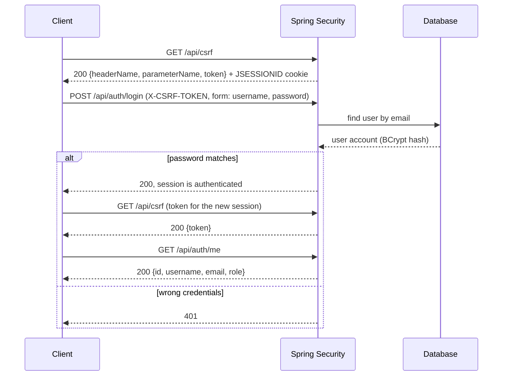
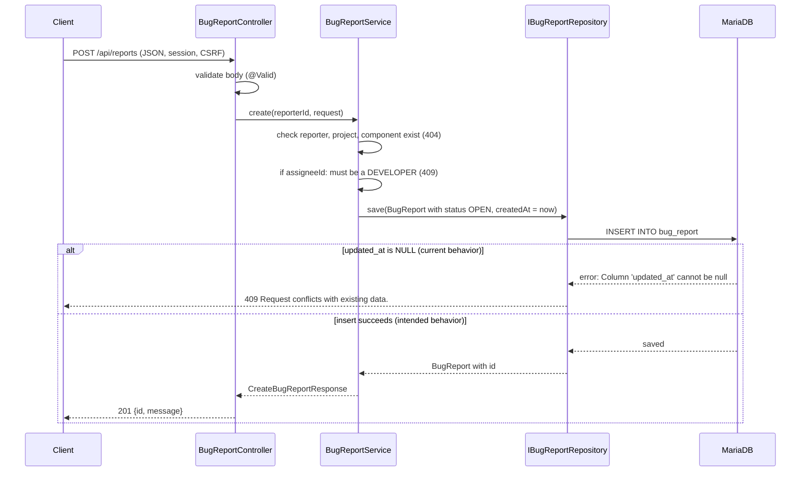

# REST API reference

Back to the [README](../README.md).

All endpoints are under `/api`. Request and response bodies are JSON with camelCase field
names. The examples on this page were produced by calling the running backend (built and started
with Docker Compose) with `curl`, using the [demo accounts](../README.md#demo-credentials); ids
and timestamps differ on every run. Where an example could not be verified, it says so.

A generated OpenAPI specification is available too, see [API documentation](../README.md#api-documentation).

Contents: [Conventions](#conventions) · [Authentication and CSRF](#authentication-and-csrf) ·
[Bug reports](#bug-reports) · [Comments](#comments) · [Projects](#projects) ·
[Components](#components) · [Accounts](#accounts)

## Conventions

**Authentication.** A session cookie (`JSESSIONID`) is created by `POST /api/auth/login`. Every
endpoint except `GET /api/csrf`, `POST /api/accounts` (registration) and the login endpoint needs
a signed-in user. Any URL that is not explicitly allowed in `SecurityConfig` is denied, so an
unknown path answers **403**, not 404, even for an admin.

**CSRF.** `POST`, `PATCH` and `DELETE` requests, including login and logout, must send the token
from `GET /api/csrf` in the `X-CSRF-TOKEN` header, together with the session cookie that the token
request set. Without it the answer is 403 `Access denied.`

**Roles.** `REPORTER`, `DEVELOPER`, `ADMIN`. Endpoints that change a report also apply a rule in
the service: the caller must be an admin, or the report's reporter or assignee (403 otherwise).
See [Business rules](domain-model.md#business-rules-in-the-services).

**Errors.** Errors have the body `{"message": "..."}`:

| Status | When | Example message |
| --- | --- | --- |
| 400 | Validation failed, malformed JSON or a malformed id | `Request contains invalid values.` |
| 401 | Not signed in | `Authentication is required.` |
| 403 | Missing role, ownership rule failed, missing CSRF token, or unknown URL | `Access denied.` |
| 404 | A referenced report, comment, project, component or user does not exist | `Report with id: 0000...` |
| 409 | Business rule conflict, duplicate email, or a database constraint failed | `Report is closed and cannot be updated.` |

**Update endpoints.** `PATCH` endpoints change one field each and answer 200 with
`{"id": "...", "message": "..."}`, except `PATCH /api/accounts/{userId}/role`, which answers 204
without a body.

Endpoint summary: see the [table in the README](../README.md#rest-api).

## Authentication and CSRF

### Sequence



_Figure: Sign-in flow as the frontend performs it (`frontend/src/api/auth.js`). The token is
fetched again after login because the session changes._

### `GET /api/csrf`

Public. Returns the token for the current session.

```json
{
  "headerName": "X-CSRF-TOKEN",
  "parameterName": "_csrf",
  "token": "SuInECbd...DQn5RyHitDgSki8V"
}
```

### `POST /api/auth/login`

Public. Form-encoded body, **not** JSON: `username` (the email address) and `password`. Needs the
CSRF header. Answers 200 with an empty body on success and 401 with an empty body on failure.

```shell
curl -c cookies -b cookies -H "X-CSRF-TOKEN: $TOKEN" \
  -d "username=admin@bugreport.local&password=Admin123!" \
  http://localhost:8080/api/auth/login
```

### `POST /api/auth/logout`

Needs the CSRF header. Answers 200 with an empty body and ends the session.

### `GET /api/auth/me`

Any signed-in user. Returns the current user (`username` is the display name).

```json
{
  "id": "a00638ee-4890-4ea6-8def-9ea2f2f4e827",
  "username": "Alice Admin",
  "email": "admin@bugreport.local",
  "role": "ADMIN"
}
```

## Bug reports

| Method | Path | Purpose | Access |
| --- | --- | --- | --- |
| GET | `/api/reports` | All reports, brief | Signed in |
| GET | `/api/reports/{reportId}` | One report in full | Signed in |
| GET | `/api/reports/reported` | Reports filed by the caller | Signed in |
| GET | `/api/reports/assigned` | Reports assigned to the caller (including closed) | Signed in |
| POST | `/api/reports` | File a report | Signed in |
| POST | `/api/reports/{reportId}/resolution` | Close a report | Admin, reporter or assignee |
| PATCH | `/api/reports/{reportId}/assignee` | Assign a developer | Admin, reporter or assignee |
| PATCH | `/api/reports/{reportId}/severity` | Change severity | Admin, reporter or assignee |
| PATCH | `/api/reports/{reportId}/status` | Change status | Admin, reporter or assignee |
| PATCH | `/api/reports/{reportId}/project` | Move to another project | Admin, reporter or assignee |
| PATCH | `/api/reports/{reportId}/component` | Move to another component | Admin, reporter or assignee |
| PATCH | `/api/reports/{reportId}/description` | Replace the description | Admin, reporter or assignee |
| PATCH | `/api/reports/{reportId}/steps-to-reproduce` | Replace the steps | Admin, reporter or assignee |
| PATCH | `/api/reports/{reportId}/expected-behavior` | Replace expected behavior | Admin, reporter or assignee |
| PATCH | `/api/reports/{reportId}/actual-behavior` | Replace actual behavior | Admin, reporter or assignee |

**Closed reports.** Once a report is closed, all `PATCH` endpoints, adding a comment and deleting a
comment answer 409 (`Report is closed and cannot be updated.`, `Comments cannot be changed on a
closed report.`).

### `GET /api/reports`, `/reported`, `/assigned`

Return a list of brief reports. `assignee` is `null` when unassigned. `createdAt` is an ISO-8601 timestamp.

```json
[
  {
    "reportId": "01c5b494-8826-4bc8-8044-3dd3f4aa8068",
    "title": "Severity selector overflows on mobile",
    "author": "Alice Admin",
    "assignee": null,
    "status": "OPEN",
    "severity": "LOW",
    "createdAt": "2026-09-29T11:46:00.123456"
  }
]
```

### `GET /api/reports/{reportId}`

Returns the full report with names instead of ids. `resolution` is `null` until the report is
closed. Answers 404 if the report does not exist and 400 if the id is not a UUID.

```json
{
  "id": "4af2df7a-336d-4f22-942e-ae013c4279ff",
  "reporterName": "Rachel Reporter",
  "assigneeName": "Fiona Frontend",
  "projectName": "Bug Report System",
  "componentName": "Web Client",
  "title": "Profile page is blank without an avatar",
  "description": "Accounts without an avatar see a blank profile page.",
  "stepsToReproduce": "Create an account without an avatar and open its profile.",
  "expectedBehavior": "The profile displays a default avatar.",
  "actualBehavior": "The profile content is not rendered.",
  "severity": "MEDIUM",
  "status": "CLOSED",
  "createdAt": "2026-09-23T19:46:16.271279",
  "updatedAt": "2026-09-28T19:46:16.271279",
  "resolution": {
    "id": "1fcc05db-486f-4bf1-9d23-858f3881416d",
    "description": "Handle an absent optional avatar before constructing the user response.",
    "resolvedAt": "2026-09-28T19:46:16.271279",
    "fixedVersion": "0.1.1",
    "commitUrl": "https://example.invalid/commits/7a21c9d"
  }
}
```

### `POST /api/reports`

Files a report as the signed-in user; the status starts as `OPEN`.

| Field | Required | Notes |
| --- | --- | --- |
| `projectId` | yes | UUID of an existing project (404 otherwise) |
| `componentId` | yes | UUID of an existing component (404 otherwise) |
| `title` | yes | Not blank |
| `severity` | yes | `LOW`, `MEDIUM`, `HIGH` or `CRITICAL` |
| `assigneeId` | no | Must be a user with the `DEVELOPER` role (409 otherwise) |
| `description`, `stepsToReproduce`, `expectedBehavior`, `actualBehavior` | no | Free text |

```json
{
  "projectId": "8dba352b-691d-42ad-88f0-acd1e1b9bb47",
  "componentId": "f3065c82-1632-439f-b51c-a84c8fc0a2b8",
  "title": "Login button unresponsive",
  "severity": "HIGH",
  "description": "Nothing happens on click."
}
```

The code answers 201 with `{"id": "<new report id>", "message": "Successfully created!"}`.

> **Known issue (verified):** in the current build this request fails with **409**
> `{"message": "Request conflicts with existing data."}` even for valid input. The backend log
> shows `Column 'updated_at' cannot be null`: `BugReportService.create` never sets `updatedAt`, but
> the `bug_report.updated_at` column is `NOT NULL`. The 201 response above therefore comes from
> the code, not from a real call. Validation errors (400) and unknown project or component (404)
> are checked before the save and work. See [Oddities.md](../Oddities.md), item 1.

#### Create flow



_Figure: What `POST /api/reports` does, including the failure that currently happens at the
insert. Creating a report publishes no event, even with an assignee._

### `POST /api/reports/{reportId}/resolution`

Closes the report: creates the resolution, sets the status to `CLOSED`, and notifies the reporter
and the assignee by email.

| Field | Required | Notes |
| --- | --- | --- |
| `description` | yes | Not blank |
| `fixedVersion` | no | |
| `commitUrl` | no | |

```json
{ "description": "Fixed the overflow.", "fixedVersion": "0.1.2", "commitUrl": "https://example.invalid/commit/abc" }
```

Answers 201 with the id of the closed report.

```json
{ "reportId": "b77f24c8-e300-4baa-8fda-471702256066", "message": "Task has been closed successfully!" }
```

Errors: 404 (no such report), 409 (`Report is already closed and cannot be reopened.`).

### `PATCH /api/reports/{reportId}/...`

Request bodies (all fields required; text fields may be empty but not `null`):

| Path segment | Body |
| --- | --- |
| `assignee` | `{"assigneeId": "<developer id>"}`; 409 if the user is not a developer, 404 if unknown |
| `severity` | `{"severity": "LOW"}` |
| `status` | `{"status": "IN_PROGRESS"}`; 409 for `CLOSED` (`Use the resolution endpoint to close a report.`) |
| `project` | `{"projectId": "<id>"}`; 404 if unknown |
| `component` | `{"componentId": "<id>"}`; 404 if unknown (not checked against the report's project) |
| `description` | `{"description": "..."}` |
| `steps-to-reproduce` | `{"stepsToReproduce": "..."}` |
| `expected-behavior` | `{"expectedBehavior": "..."}` |
| `actual-behavior` | `{"actualBehavior": "..."}` |

Response (200):

```json
{ "id": "01c5b494-8826-4bc8-8044-3dd3f4aa8068", "message": "Bug report updated successfully!" }
```

Assigning does not change the status. `updatedAt` is not refreshed by any update. Assigning
(`AssigneeChangedEvent`) and status changes (`StatusChangedEvent`) send an email. The status
email is sent even if the status did not change.

## Comments

| Method | Path | Purpose | Access |
| --- | --- | --- | --- |
| GET | `/api/reports/{reportId}/comments` | Comments of a report, newest first | Signed in |
| POST | `/api/reports/{reportId}/comments` | Add a comment | Signed in |
| DELETE | `/api/comments/{commentId}` | Delete a comment | Admin or the comment's author |

`POST` body: `{"content": "Reproduced, working on a fix."}` (not blank, otherwise 400). Response
(201):

```json
{
  "id": "4ae01c39-1fdc-4b43-aca6-ebd5a4ad78ce",
  "authorId": "1268f562-274d-408e-9e1f-dc053320323f",
  "authorName": "Daniel Developer",
  "content": "Reproduced, working on a fix.",
  "createdAt": "2026-09-29T19:47:41.050461239"
}
```

`GET` response (200):

```json
[
  {
    "id": "4ae01c39-1fdc-4b43-aca6-ebd5a4ad78ce",
    "bugReportId": "01c5b494-8826-4bc8-8044-3dd3f4aa8068",
    "authorId": "1268f562-274d-408e-9e1f-dc053320323f",
    "authorName": "Daniel Developer",
    "content": "Reproduced, working on a fix.",
    "createdAt": "2026-09-29T19:47:41.050461"
  }
]
```

`DELETE` answers 204 without a body; another user (not admin, not author) gets 403.

## Projects

| Method | Path | Purpose | Access |
| --- | --- | --- | --- |
| GET | `/api/projects` | All projects | Signed in |
| POST | `/api/projects` | Create a project | Admin |
| PATCH | `/api/projects/{projectId}/name` | Rename | Admin or developer |
| PATCH | `/api/projects/{projectId}/description` | Replace the description | Admin or developer |

`GET` response:

```json
[
  {
    "id": "8dba352b-691d-42ad-88f0-acd1e1b9bb47",
    "name": "Bug Report System",
    "description": "Application for reporting and resolving software defects."
  }
]
```

`POST` body `{"name": "Mobile App", "description": "iOS and Android clients."}` (`name` not
blank, `description` optional) answers 201 with `{"id": "...", "message": "Successfully created!"}`.
`PATCH` bodies are `{"name": "..."}` (not blank) and `{"description": "..."}` (not `null`); they
answer 200 with `{"id": "...", "message": "Project updated successfully!"}`.

## Components

| Method | Path | Purpose | Access |
| --- | --- | --- | --- |
| GET | `/api/components` | All components | Signed in |
| POST | `/api/components` | Create a component | Admin or developer |
| PATCH | `/api/components/{componentId}/name` | Rename | Admin or developer |
| PATCH | `/api/components/{componentId}/description` | Replace the description | Admin or developer |
| PATCH | `/api/components/{componentId}/responsibleUserId` | Change the responsible user | Admin or developer |

Note the camelCase path segment `responsibleUserId`, unlike the kebab-case segments of the report
endpoints.

`GET` response:

```json
[
  {
    "id": "f3065c82-1632-439f-b51c-a84c8fc0a2b8",
    "name": "Backend API",
    "description": "REST API and persistence layer.",
    "responsibleUserName": "Daniel Developer"
  }
]
```

`POST` body:

```json
{ "name": "Push Notifications", "description": "Push service.", "responsibleUserId": "8afb36ab-36d0-46ea-b0bb-a673d8fbff46" }
```

Answers 201 with `{"id": "...", "message": "Successfully created!"}`. Only `name` (not blank) is
validated. `responsibleUserId` is checked only by the database: a missing or unknown user
answers **409** `Request conflicts with existing data.` (verified). `PATCH` bodies are
`{"name": "..."}`, `{"description": "..."}` and `{"responsibleUserId": "<id>"}`; they answer 200
with `{"id": "...", "message": "Component updated successfully!"}`, or 404 for an unknown
component.

## Accounts

| Method | Path | Purpose | Access |
| --- | --- | --- | --- |
| POST | `/api/accounts` | Register a new account (role `REPORTER`) | Public |
| GET | `/api/accounts` | All accounts | Admin |
| GET | `/api/accounts/developers` | Users with the `DEVELOPER` role | Signed in |
| GET | `/api/accounts/users?search=` | Users whose name contains the text | Admin or developer |
| PATCH | `/api/accounts/{userId}/role` | Change a role | Admin (not for their own account) |

### `POST /api/accounts`

```json
{ "username": "New User", "email": "new.user@example.com", "password": "Secret123!" }
```

All fields are required and not blank; `email` must be a valid address (an address with
surrounding spaces is rejected with 400). The address is stored lower-cased, so a second
registration that differs only in case answers 409
`An account with this email address already exists.` Success: 201 with
`{"id": "...", "message": "Successfully created!"}`.

### `GET /api/accounts`

`username` is the display name; the login name is `email`.

```json
[
  { "id": "a00638ee-4890-4ea6-8def-9ea2f2f4e827", "username": "Alice Admin", "email": "admin@bugreport.local", "role": "ADMIN" }
]
```

### `GET /api/accounts/developers`

```json
[ { "id": "1268f562-274d-408e-9e1f-dc053320323f", "name": "Daniel Developer" } ]
```

### `GET /api/accounts/users?search=ra`

Case-insensitive search in the name; an empty or missing `search` returns `[]`.

```json
[ { "userId": "6f30e1aa-1cb9-453b-a82a-77cd9dfde971", "name": "Rachel Reporter" } ]
```

### `PATCH /api/accounts/{userId}/role`

Body `{"role": "DEVELOPER"}` (`REPORTER`, `DEVELOPER` or `ADMIN`); answers 204 without a body.
Rules:

- An admin cannot change their own role (403).
- The last admin cannot be demoted (409 `At least one admin account must remain.`).
- A developer with unclosed assigned reports cannot get another role (409
  `A developer with open bug report assignments cannot be assigned a different role.`).
