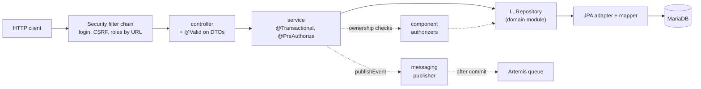
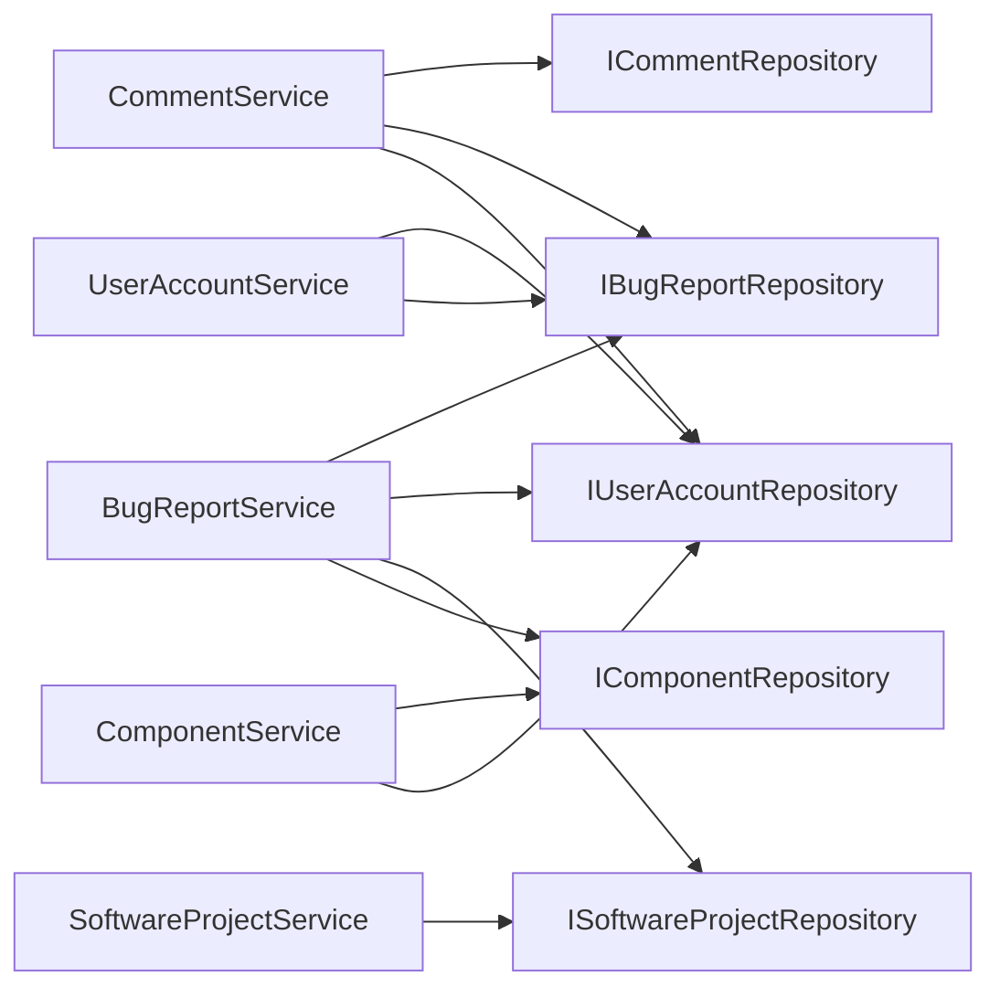
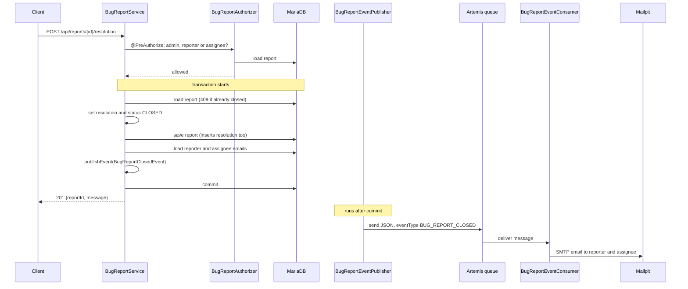
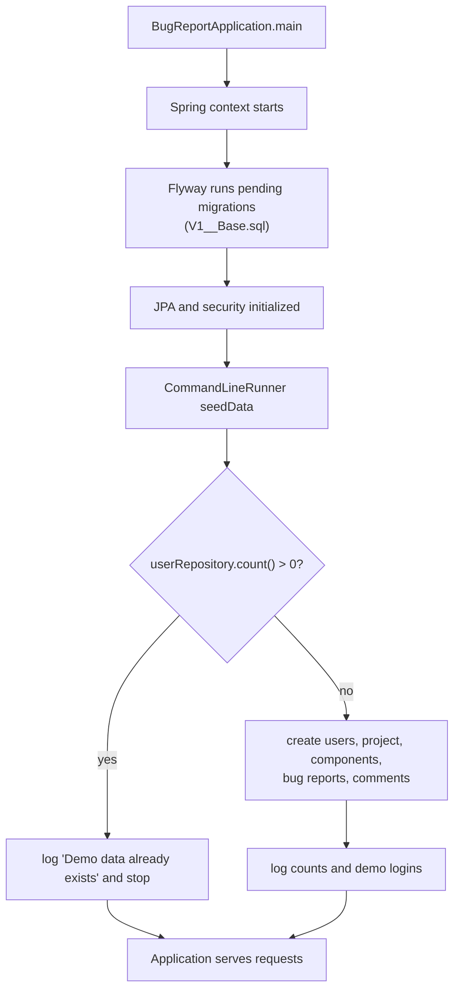

# Backend reference

Back to the [README](../README.md).

The backend is a Maven multi-module project in [backend/](../backend/) (Java 21, Spring Boot
4.1.0). This page explains how the code is organized and how the main flows work. The endpoints
themselves are in the [API reference](api-reference.md), the entities in the
[domain model reference](domain-model.md).

Contents: [Modules](#modules-and-packages) · [Layers](#layers-and-responsibilities) ·
[Security](#security) · [Error handling](#error-handling) · [Messaging](#messaging-and-email) ·
[Closing a report](#flow-closing-a-report) · [Startup and seeding](#startup-and-demo-data) ·
[Configuration](#configuration)

## Modules and packages

| Module | Contents |
| --- | --- |
| [bug-report-domain](../backend/bug-report-domain/) | Domain classes and enums (`com.ramy.bugreport.domain`) and the repository interfaces (`com.ramy.bugreport.repository`, all named `I...Repository`). Plain Java, no framework dependencies. |
| [bug-report-api](../backend/bug-report-api/) | The Spring Boot application `BugReportApplication` and everything that depends on Spring, listed below. Depends on the domain module. |

Packages of `bug-report-api` under `com.ramy.bugreport`:

| Package | Purpose |
| --- | --- |
| `controller` | REST controllers. Translate HTTP to service calls; no business logic. |
| `dto` | Request and response records, grouped by resource (`report`, `comment`, `project`, `component`, `account`). Validation annotations (`@NotBlank`, `@NotNull`, `@Email`) are on the requests. |
| `service` | Business logic: `BugReportService`, `CommentService`, `SoftwareProjectService`, `ComponentService`, `UserAccountService`. Transactions and `@PreAuthorize` rules live here. |
| `component` | Authorizers used in `@PreAuthorize` expressions: `BugReportAuthorizer`, `CommentAuthorizer`, `UserAccountAuthorizer`. (The name has nothing to do with the project's `Component` entity.) |
| `security` | `SecurityConfig`, the current-user filter, the user details classes and the 401/403 handlers. |
| `exception` | Custom exceptions, `ApiExceptionHandler` and the `ApiErrorResponse` body. |
| `persistence` | JPA `entity` classes, static `mapper` classes, and the `repository` implementations (`jpa/adapter` and `jpa/repository`). |
| `messaging` | `event` records, the `publisher` and the `consumer` that sends emails. |

`src/main/resources` contains `application.yml` and the Flyway migration
`db/migration/V1__Base.sql`.

## Layers and responsibilities

_Figure: Layers of the backend. Solid arrows are the request path; dashed arrows are side paths
(ownership checks and event publishing)._

Where each kind of check happens:

1. **Security filter chain** (`SecurityConfig`): is the user signed in, is the CSRF token valid,
   does the role match the URL rule. Anything not listed is denied.
2. **Controller**: `@Valid` on the request body (400 on failure), `@AuthenticationPrincipal` to
   get the current user.
3. **Service**: existence checks (404), business rules (409), and ownership rules with
   `@PreAuthorize("hasRole('ADMIN') or @bugReportAuthorizer.canUpdate(#reportId, authentication)")`.
4. **Repository adapter**: converts between domain objects and entities. Services never see
   entities.

### Services and their repositories

_Figure: Repository dependencies of the services, taken from their constructors. The
resolution is saved together with the report (cascade), so no service uses
`IResolutionRepository`. `BugReportService` also uses Spring's `ApplicationEventPublisher`;
`UserAccountService` uses the `PasswordEncoder`._

Repository adapters are read-only transactional by default; methods that write override this with
a normal transaction. Only `BugReportEntity.resolution` is a real JPA association (see
[Persistence notes](domain-model.md#persistence-notes)).

## Security

Implemented in [SecurityConfig](../backend/bug-report-api/src/main/java/com/ramy/bugreport/security/SecurityConfig.java).

- **Sessions.** Form login at `POST /api/auth/login` (fields `username` = email and `password`)
  creates a session cookie. Success and failure only set the status (200 or 401); there are no
  redirects.
- **Passwords.** Checked and hashed with `BCryptPasswordEncoder`. `UserAccountDetailsService`
  loads the account by lower-cased email address; the authority is `ROLE_` + the role name.
- **Fresh user on every request.** `CurrentUserAuthenticationFilter` reloads the account from the
  database on each request, so a role change applies immediately. If the account no longer exists,
  the security context is cleared and the request continues as anonymous (so it answers 401).
- **CSRF.** Spring's default protection stays on; the token is exposed by `GET /api/csrf`.
- **CORS.** Only the origin `http://localhost:5173` (the Vite dev server) is allowed, with
  credentials, the methods `GET`, `POST`, `PATCH`, `DELETE`, `OPTIONS` and the headers
  `Content-Type` and `X-CSRF-TOKEN`. The origin is hard-coded.
- **URL rules.** Roles per URL are listed in the
  [API overview](../README.md#rest-api); everything else is `denyAll`.
- **Errors.** `ApiAuthenticationEntryPoint` answers 401 `{"message":"Authentication is required."}`
  and `ApiAccessDeniedHandler` answers 403 `{"message":"Access denied."}`.
- **Ownership rules** are `@PreAuthorize` expressions on service methods (`@EnableMethodSecurity`):
  admin, or the reporter or assignee of the report (`BugReportAuthorizer`); admin or author of
  the comment (`CommentAuthorizer`); admin and not the caller's own account
  (`UserAccountAuthorizer`).

## Error handling

`ApiExceptionHandler` (`@RestControllerAdvice`) turns exceptions into `{"message": "..."}`:

| Exception | Status |
| --- | --- |
| `ResourceNotFoundException` | 404 (message says what was not found) |
| `BusinessRuleConflictException`, `DuplicateEmailException` | 409 |
| `DataIntegrityViolationException` | 409 `Request conflicts with existing data.` |
| `MethodArgumentNotValidException`, `HttpMessageNotReadableException`, `MethodArgumentTypeMismatchException` | 400 `Request contains invalid values.` |
| `AccessDeniedException` | 403 `Access denied.` |

Other exceptions are not handled here and use Spring's default handling.

## Messaging and email

Changes to a report send an email without slowing down or failing the HTTP request.

| Event (`eventType`) | Published by | Recipients |
| --- | --- | --- |
| `ASSIGNEE_CHANGED` (`AssigneeChangedEvent`) | `BugReportService.updateAssignee` | the new assignee |
| `STATUS_CHANGED` (`StatusChangedEvent`) | `BugReportService.updateStatus` | reporter and assignee |
| `BUG_REPORT_CLOSED` (`BugReportClosedEvent`) | `BugReportService.close` | reporter and assignee |

- The service calls `ApplicationEventPublisher.publishEvent(...)` inside its transaction.
- `BugReportEventPublisher` is a `@TransactionalEventListener(phase = AFTER_COMMIT)`: it sends the
  event as JSON (with an `eventType` property, see `IBugReportEvent`) to the Artemis queue named by
  `messaging.destinations.bug-report-event` (`bug-report-event`). If the transaction rolls back,
  nothing is sent.
- `BugReportEventConsumer` is a `@JmsListener` on that queue. It builds a plain-text email from
  `no-reply@bugreport.local` and sends it through `JavaMailSender` (to Mailpit in the development
  setup). Events with no recipient address are skipped.

Verified behavior: with Mailpit stopped, the API request still succeeds and the backend only
logs a warning that the JMS listener failed. Creating a report (when it works) and adding
comments send no email.

## Flow: closing a report

_Figure: The close-report flow, the most involved one. The HTTP response and the email are
independent: a mail failure does not change the 201._

## Startup and demo data

_Figure: Application startup. Seeding runs only when the database has no users, so restarting
with the same database volume never duplicates the demo data._

The database is MariaDB (not an in-memory database); its data survives restarts as long as the
`mariadb-data` Docker volume exists. The schema comes from Flyway only; no `ddl-auto` setting is
configured.

Data created by `BugReportApplication.seedData` on an empty database:

| Kind | Content |
| --- | --- |
| Users | Alice Admin (`ADMIN`), Daniel Developer (`DEVELOPER`), Fiona Frontend (`DEVELOPER`), Rachel Reporter (`REPORTER`), see [demo credentials](../README.md#demo-credentials) |
| Project | Bug Report System |
| Components | Backend API (responsible: Daniel), Web Client (responsible: Fiona) |
| Report 1 | "Valid users cannot sign in": `CRITICAL`, `IN_PROGRESS`, Backend API, reported by Rachel, assigned to Daniel |
| Report 2 | "Profile page is blank without an avatar": `MEDIUM`, `CLOSED` with a resolution (fixed in `0.1.1`), Web Client, reported by Rachel, assigned to Fiona |
| Report 3 | "Severity selector overflows on mobile": `LOW`, `OPEN`, Web Client, reported by Alice, unassigned |
| Comments | Two on report 1 (Rachel, Daniel), one on report 2 (Fiona) |

Attachments are not seeded (that code is commented out). The demo passwords are hard-coded in the
source and written to the log at startup; only BCrypt hashes are stored.

## Configuration

Settings are in
[application.yml](../backend/bug-report-api/src/main/resources/application.yml): the datasource
(`jdbc:mariadb://database:3306/bug_report`), the Artemis broker (`tcp://artemis:61616`), the mail
server (`mailpit:1025`) and `messaging.destinations.bug-report-event`. The host names are the
Docker Compose service names, so the backend is meant to run inside the Compose network. Tests use
[application-test.yml](../backend/bug-report-api/src/test/resources/application-test.yml), which
points to `localhost:3306/bug_report_test`. A full configuration table follows in the
configuration reference of the README.
