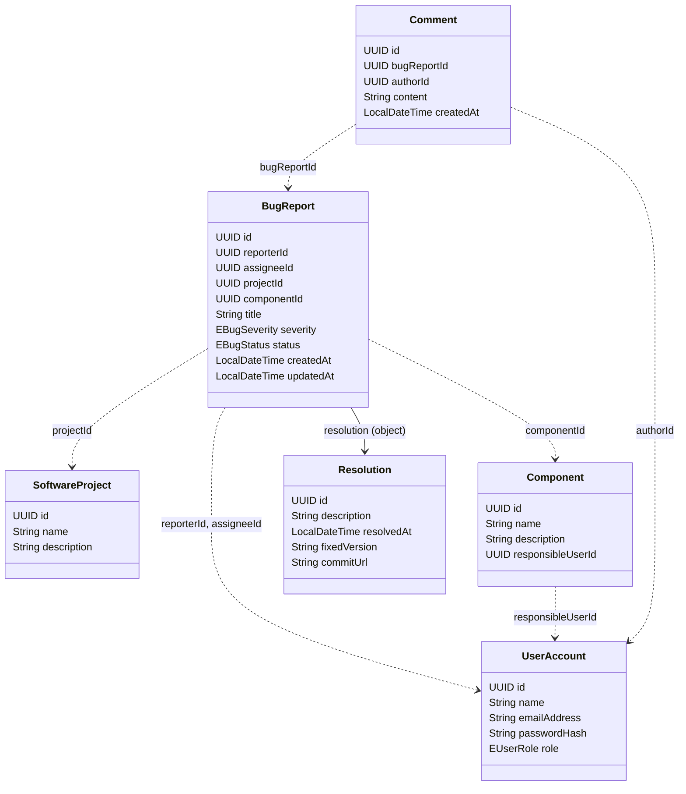
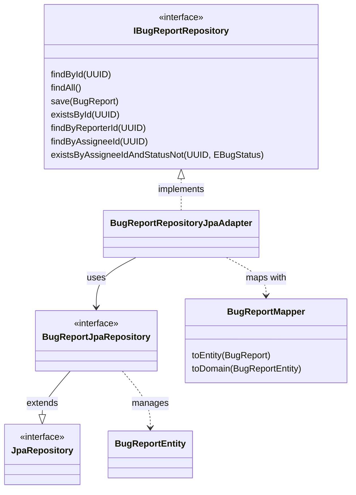

# Domain model reference

Back to the [README](../README.md).

This page describes the entities of the bug report system, their fields, their relations and
the rules the code enforces on them. It is based on the domain classes in
[bug-report-domain](../backend/bug-report-domain/src/main/java/com/ramy/bugreport/domain/), the
JPA entities in
[persistence/entity](../backend/bug-report-api/src/main/java/com/ramy/bugreport/persistence/entity/)
and the schema in
[V1__Base.sql](../backend/bug-report-api/src/main/resources/db/migration/V1__Base.sql).

Contents: [Entities](#entities) · [Enums](#enums) · [Relations](#relations) ·
[Business rules](#business-rules-in-the-services) · [Persistence notes](#persistence-notes) ·
[Class diagrams](#class-diagrams)

## Entities

Ids are UUIDs stored as `CHAR(36)`; they are generated on save (`null` before that).
Timestamps are `DATETIME(6)` and map to `LocalDateTime`.

### UserAccount (`user_account`)

| Field (column) | Type | Required | Description |
| --- | --- | --- | --- |
| `id` (`id`) | UUID | yes | Primary key. |
| `name` (`name`) | string (255) | yes | Display name. |
| `emailAddress` (`email_address`) | string (255) | yes, unique | Login name. Registration stores it lower-cased (an address with surrounding spaces is rejected by validation). |
| `passwordHash` (`password_hash`) | string (255) | yes | BCrypt hash of the password. |
| `role` (`role`) | `EUserRole` | yes | `REPORTER`, `DEVELOPER` or `ADMIN`. |
| (`archived_at`) | datetime | no | Column exists but is not used by any code. |

Only the role can be changed after construction.

### SoftwareProject (`software_project`)

| Field (column) | Type | Required | Description |
| --- | --- | --- | --- |
| `id` | UUID | yes | Primary key. |
| `name` | string (255) | yes | Display name. |
| `description` | text | no | Free text. |
| (`archived_at`) | datetime | no | Unused column. |

### Component (`component`)

| Field (column) | Type | Required | Description |
| --- | --- | --- | --- |
| `id` | UUID | yes | Primary key. |
| `name` | string (255) | yes | Display name. |
| `description` | text | no | Free text. |
| `responsibleUserId` (`responsible_user_id`) | UUID | yes | Foreign key to `user_account`. |
| (`archived_at`) | datetime | no | Unused column. |

A component is not linked to a project in the database; a bug report refers to both a project and
a component independently.

### BugReport (`bug_report`)

| Field (column) | Type | Required | Description |
| --- | --- | --- | --- |
| `id` | UUID | yes | Primary key. |
| `reporterId` (`reporter_id`) | UUID | yes | Foreign key to `user_account`: who filed the report. |
| `assigneeId` (`assignee_id`) | UUID | no | Foreign key to `user_account`: who works on it; `null` while unassigned. |
| `projectId` (`project_id`) | UUID | yes | Foreign key to `software_project`. |
| `componentId` (`component_id`) | UUID | yes | Foreign key to `component`. |
| `title` | string (255) | yes | Short summary. |
| `description` | text | no | Free text. |
| `stepsToReproduce` (`steps_to_reproduce`) | text | no | How to reproduce the bug. |
| `expectedBehavior` (`expected_behavior`) | text | no | What should happen. |
| `actualBehavior` (`actual_behavior`) | text | no | What happens instead. |
| `severity` | `EBugSeverity` | yes | `LOW`, `MEDIUM`, `HIGH` or `CRITICAL`. |
| `status` | `EBugStatus` | yes | Always `OPEN` when built through the builder. |
| `createdAt` (`created_at`) | datetime | yes | Set by `BugReportService.create` (but see the note below). |
| `updatedAt` (`updated_at`) | datetime | yes | See the note below. |
| `resolution` (`resolution_id`) | Resolution | no | Unique foreign key to `resolution`; `null` until closed. |

Instances are created with `BugReport.builder(reporterId, projectId, componentId, title,
severity)`. The builder cannot set the id, the status or the resolution.

> **Known issue (verified):** `updated_at` is `NOT NULL`, but `BugReportService` never sets
> `updatedAt` on create or update. Creating a report therefore fails with 409 (`Column
> 'updated_at' cannot be null`), and updates never refresh it. Only the seeded reports have a
> value. See [Oddities.md](../Oddities.md), item 1.

### Resolution (`resolution`)

| Field (column) | Type | Required | Description |
| --- | --- | --- | --- |
| `id` | UUID | yes | Primary key. |
| `description` | text | no in the database, required by the API | What was done to fix the bug. |
| `resolvedAt` (`resolved_at`) | datetime | yes | Set when the report is closed. |
| `fixedVersion` (`fixed_version`) | string (100) | no | Version that contains the fix. |
| `commitUrl` (`commit_url`) | string (2048) | no | URL of the fixing commit. |

Immutable after construction.

### Comment (`comment`)

| Field (column) | Type | Required | Description |
| --- | --- | --- | --- |
| `id` | UUID | yes | Primary key. |
| `bugReportId` (`bug_report_id`) | UUID | yes | Foreign key to `bug_report`. |
| `authorId` (`author_id`) | UUID | yes | Foreign key to `user_account`. |
| `content` | text | yes | Comment text. |
| `createdAt` (`created_at`) | datetime | yes | Set by `CommentService.create`. |

Immutable after construction.

### Attachment (not persisted)

`Attachment` (`id`, `bugReportId`, `uploaderId`, `fileName`, `contentType`, `storagePath`,
`uploadedAt`) exists only as a domain class. There is no table, entity, repository or endpoint for
it, and the demo seeding code for it is commented out. Attachments are not a working feature.

## Enums

Enums are stored by name (`VARCHAR(32)`), and each one is also guarded by a `CHECK` constraint in
`V1__Base.sql`.

| Enum | Values | Used by |
| --- | --- | --- |
| `EUserRole` | `REPORTER`, `DEVELOPER`, `ADMIN` | `UserAccount.role` |
| `EBugSeverity` | `LOW`, `MEDIUM`, `HIGH`, `CRITICAL` (least to most severe) | `BugReport.severity` |
| `EBugStatus` | `OPEN`, `ASSIGNED`, `IN_PROGRESS`, `NEEDS_INFORMATION`, `REVIEWING`, `REJECTED`, `CLOSED` | `BugReport.status` |

`EBugStatus.canTransitionTo` defines the allowed status changes; see the lifecycle diagram in the
[README](../README.md#bug-report-lifecycle). `ASSIGNED` and `REJECTED` are not part of the lifecycle.

## Relations

- A **user** can report many bug reports, be assigned many, and write many comments.
- A **user** can be responsible for many components (each component has exactly one).
- A **project** and a **component** can each have many bug reports. A report belongs to exactly
  one of each. The code does not check that the component belongs to the project.
- A **bug report** has many comments and at most one resolution (one-to-one, unique
  `resolution_id`).

The full picture is the ER diagram in the [README](../README.md#domain-model). Foreign keys exist
only in the database. In the JPA entities, every relation is a plain UUID column; the only mapped
association is `BugReportEntity.resolution` (`@OneToOne`, with cascade and orphan removal).

## Business rules in the services

These rules are enforced by the service classes, not by the domain classes or the database:

| Rule | Where |
| --- | --- |
| A closed report cannot be updated, assigned, commented on or have comments deleted (409). | `BugReportService.reportById`, `CommentService.requireOpenReport` |
| A report is closed only by adding a resolution; setting the status to `CLOSED` directly is rejected (409). | `BugReportService.updateStatus`, `close` |
| A status change must follow `EBugStatus.canTransitionTo` (409); setting the current status again does nothing and sends no notification. | `BugReportService.updateStatus` |
| A report that already has a resolution cannot be closed again (409). | `BugReportService.close` |
| Only a user with the `DEVELOPER` role can be an assignee (409). | `BugReportService.requireDeveloper` |
| Only the reporter, the assignee or an admin can change or close a report. | `@PreAuthorize` with `BugReportAuthorizer.canUpdate` |
| Only the author or an admin can delete a comment. | `@PreAuthorize` with `CommentAuthorizer` |
| The last remaining admin cannot lose the role (409). | `UserAccountService.updateRole` |
| A developer with unclosed assigned reports cannot get another role (409). | `UserAccountService.updateRole` |
| An admin cannot change their own role. | `UserAccountAuthorizer.canUpdateRole` |
| An email address can be registered only once (409). | `UserAccountService.create` |
| Registered accounts always get the `REPORTER` role. | `UserAccountService.create` |

## Persistence notes

- The schema is created by Flyway from `V1__Base.sql`; the entities do not generate it.
- `archived_at` exists on `user_account`, `software_project` and `component`, but no entity,
  mapper or query uses it; archiving does not exist.
- Domain classes are mapped to entities by static mapper classes (`persistence/mapper`);
  the domain module has no JPA annotations.
- The demo data is created by `BugReportApplication.seedData` on an empty database.

## Class diagrams

### Domain classes

_Figure: Domain classes of `bug-report-domain`. Solid arrow: held as an object. Dashed arrows:
referenced by id only. `BugReport` also has `description`, `stepsToReproduce`,
`expectedBehavior` and `actualBehavior` (omitted here). The enums and the unpersisted
`Attachment` are left out; see above._

### Repositories and persistence adapters

Every domain class has the same repository pattern; `BugReport` is shown as the example. The
interfaces live in the domain module, the implementations in the API module.

_Figure: The persistence pattern. Services depend only on `I*Repository` interfaces from the
domain module; the adapter converts between domain objects and JPA entities using the mapper and
delegates to a Spring Data repository. The same classes exist for `UserAccount`,
`SoftwareProject`, `Component`, `Resolution` and `Comment` (`IUserAccountRepository`,
`UserAccountRepositoryJpaAdapter`, and so on)._
