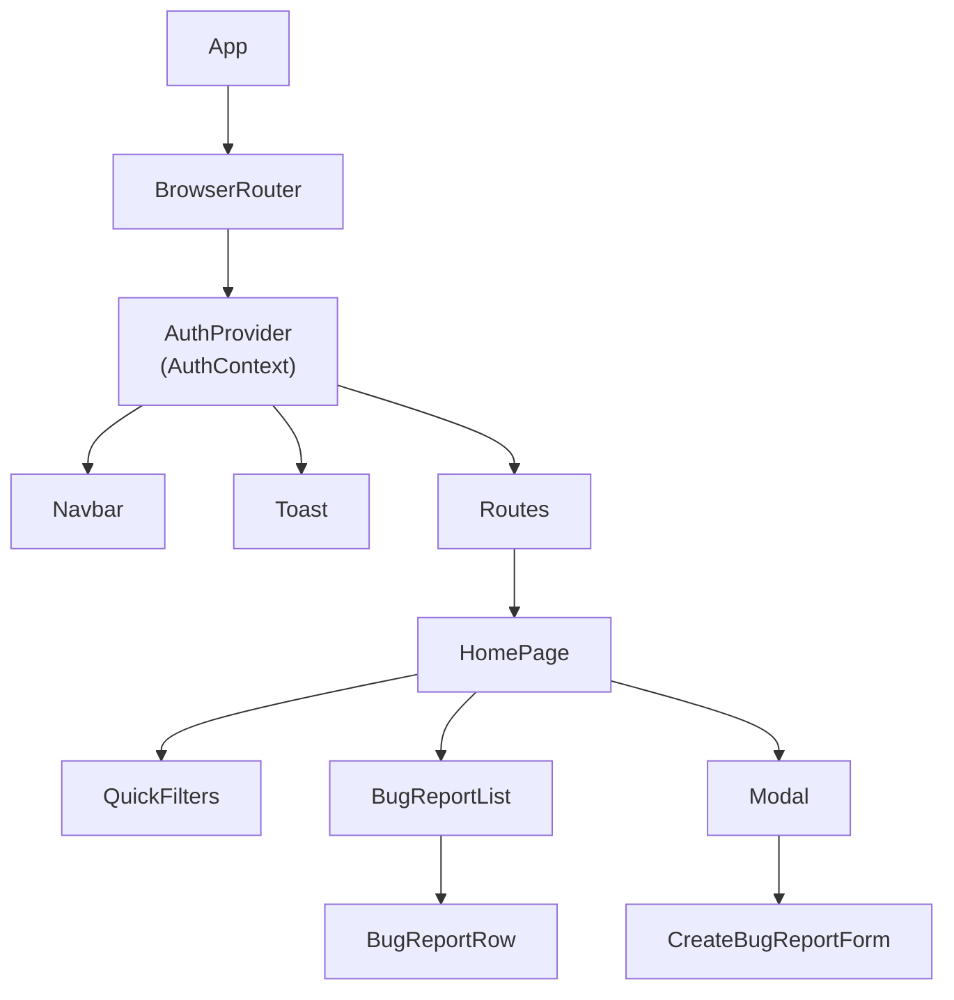
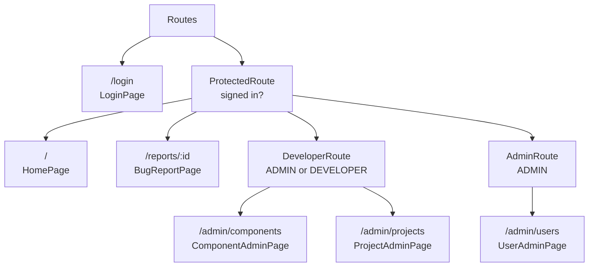
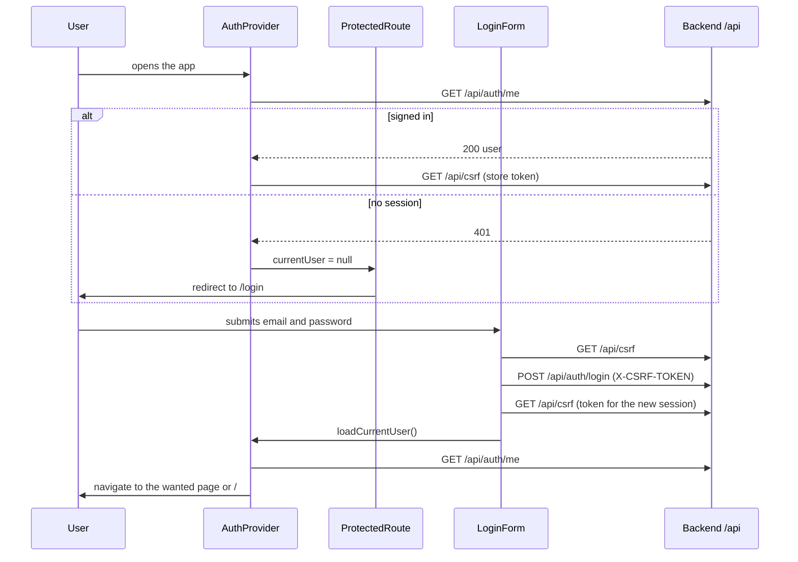
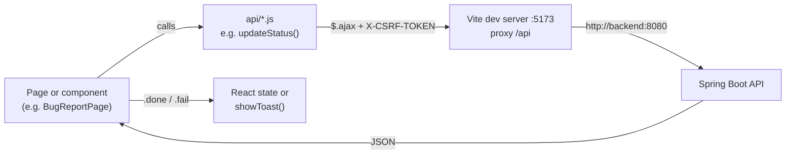

# Frontend reference

Back to the [README](../README.md).

The frontend is a single-page React application in [frontend/](../frontend/), built with Vite. It
has no state library and no TypeScript: pages keep their data in React state and load it with
jQuery `$.ajax` calls to the [REST API](api-reference.md).

Contents: [Structure](#structure) · [Routing and guards](#routing-and-access-guards) ·
[Sessions and CSRF](#sessions-and-csrf) · [Talking to the API](#talking-to-the-api) ·
[Pages](#pages) · [Shared components](#shared-components) · [Build and tooling](#build-and-tooling)

## Structure

```text
frontend/
├── index.html            Vite entry HTML (contains <div id="root">)
├── vite.config.js        React plugin and the /api proxy
├── package.json          Scripts and dependencies
├── eslint.config.js      ESLint rules
├── Dockerfile            Node image that runs the Vite dev server
└── src/
    ├── main.jsx          Loads global CSS (Bootstrap, Bootstrap Icons) and renders <App />
    ├── App.jsx           Router, AuthProvider, Navbar, Toast and the route table
    ├── api/              One module per resource; each function returns a jQuery promise
    ├── components/       Reusable UI, auth context/provider and route guards
    ├── pages/            One component per route
    ├── utils/date.js     formatDateTime helper
    └── mock-data/        bugReports.js: sample data that no file imports (unused)
```

| Folder | Files |
| --- | --- |
| `api/` | `auth.js`, `csrf.js`, `bug-report.js`, `comment.js`, `project.js`, `component.js`, `account.js`, `create-bug-report-options.js` |
| `components/` | `AuthContext`, `AuthProvider`, `ProtectedRoute`, `DeveloperRoute`, `AdminRoute`, `Navbar`, `Toast` (+ `toast.js`), `Modal`, `LoginForm`, `BugReportList`, `BugReportRow`, `QuickFilters`, `CreateBugReportForm`, `CreateProjectForm`, `CreateComponentForm` |
| `pages/` | `LoginPage`, `HomePage`, `BugReportPage`, `ProjectAdminPage`, `ComponentAdminPage`, `UserAdminPage` |

Component hierarchy of the app shell and the home page:



_Figure: Component tree of the shell and `HomePage`. `Navbar` and `Toast` are always rendered;
the other pages replace `HomePage` under `Routes`._

## Routing and access guards

Routes are defined in `App.jsx` with React Router. The guards are layout routes that render the
child route through `<Outlet />` or redirect.



_Figure: Route tree with guards._

| Guard | Condition | Otherwise |
| --- | --- | --- |
| `ProtectedRoute` | `currentUser` is set | While the session check runs (`undefined`) it renders nothing; if not signed in it redirects to `/login` and remembers the wanted page |
| `DeveloperRoute` | role `ADMIN` or `DEVELOPER` | Redirect to `/` |
| `AdminRoute` | role `ADMIN` | Redirect to `/` |

The guards and the links shown by `Navbar` are only a convenience. The backend enforces the same
roles ([Security](backend.md#security)). There is no route for unknown paths, and `/login` is
still reachable when signed in.

## Sessions and CSRF

`AuthProvider` holds `currentUser` in React state and shares it (with `loadCurrentUser` and
`logout`) through `AuthContext`. `currentUser` has three states: `undefined` (not checked yet),
`null` (not signed in) and the user object `{id, name, email, role}`.



_Figure: Session check on load and the sign-in flow. The CSRF token is kept in module variables
of `api/csrf.js`._

Every request that changes data sends the token as a header taken from `getCsrfToken()`. The
token is loaded after `GET /api/auth/me` succeeds or after login, so a write request sent before
that would have no valid token. Logout fetches a fresh token, calls `POST /api/auth/logout`, clears
the stored token and sets `currentUser` to `null`.

## Talking to the API

All requests go to relative `/api/...` URLs. In development, Vite proxies `/api` to
`http://backend:8080` ([vite.config.js](../frontend/vite.config.js)), so the browser only talks
to `http://localhost:5173` and no CORS handling is needed. The host name `backend` exists only in
the Docker Compose network (see [Getting started](../README.md#getting-started)).



_Figure: Data flow for an API call. Functions in `api/` return the jQuery promise; the caller
handles `.done`, `.fail` and `.always`._

- Modules in `api/` contain no React code. Write functions read the token with `getCsrfToken()` and
  send it as a header; JSON bodies use `contentType: "application/json"`.
- Failures are shown to the user with `showToast(severity, message, summary)` (a `Toast` at the
  top of the app listens for a window event `app:toast` and hides each toast after 5 seconds).
- `create-bug-report-options.js` provides the developers, projects and the components of one
  project (`getComponentsByProject`) used in select fields (projects and components reduced to
  `{id, name}`).

## Pages

| Route | Page | What it does |
| --- | --- | --- |
| `/login` | `LoginPage` | `LoginForm`: email and password sign-in. The "Register" button has no function. A failed login is only written to the browser console. |
| `/` | `HomePage` | Lists all reports (`GET /api/reports`) with the quick filters "Reported by me", "Assigned to me" and "Reset". "Create new +" opens a modal with `CreateBugReportForm` (`POST /api/reports`; see the known issue in the [API reference](api-reference.md#post-apireports)). |
| `/reports/:id` | `BugReportPage` | Loads the report, its comments, the status transitions and the developer and project lists, and the components of the report's project (loaded again when the project changes; changing the project removes the report's component, shown as "None"). Fields (assignee, severity, status, project, component, description, steps, expected and actual behavior) are edited inline, each with its own `PATCH` call. Comments can be added, and removed by their author or an admin. "Close issue" opens a modal for the resolution (with a confirmation dialog). A closed report is read-only and offers "Show resolution". |
| `/admin/projects` | `ProjectAdminPage` | Lists projects; rename and edit the description (admin or developer); create a project (admin only). |
| `/admin/components` | `ComponentAdminPage` | Lists components; rename, edit the description, change the responsible user (found with the user search) and create components. |
| `/admin/users` | `UserAdminPage` | Admin only. Lists all accounts, filtered and paged in the browser; changes a user's role. |

The status selector on `BugReportPage` offers only the statuses returned by
`GET /api/reports/status-transitions` for the current status. It never offers `ASSIGNED` (set by
picking an assignee) or `CLOSED` (set through the resolution form), and it is disabled for an
`OPEN` report.

## Shared components

| Component | Purpose |
| --- | --- |
| `Navbar` | Brand, links by role (Home; Users for admins; Components and Projects for admins and developers), the user's name and "Log out". |
| `Toast` / `toast.js` | Notifications: `showToast` dispatches a window event, `Toast` renders the stack. |
| `Modal` | Thin wrapper around a Bootstrap modal with an id; pages open and close it through Bootstrap's own JavaScript API. |
| `BugReportList`, `BugReportRow` | The report table on the home page; a row links to `/reports/{reportId}`. |
| `QuickFilters` | The three filter buttons; the state lives in `HomePage`. |
| `CreateBugReportForm`, `CreateProjectForm`, `CreateComponentForm` | Forms shown inside modals. |
| `LoginForm` | The sign-in form. |

## Build and tooling

| Command (in `frontend/`) | Purpose |
| --- | --- |
| `npm ci` | Install the exact versions from `package-lock.json` |
| `npm run dev` | Vite dev server on port 5173 (`--host 0.0.0.0` in the Docker image) |
| `npm run build` | Production build into `dist/` (not used by Docker Compose) |
| `npm run lint` | ESLint (React hooks and refresh rules) |
| `npm run preview` | Serve the production build locally |

`npm ci`, `npm run build` and `npm run lint` were run for this documentation and finished
without errors or warnings. There are no frontend tests. Styling uses Bootstrap 5 with Bootstrap
Icons plus small CSS files next to some components.

The dev server on the host does not reach a backend at `http://backend:8080` (the host name
resolves only inside the Compose network), so run the frontend through Docker Compose; the
Compose setup was verified: the page is served on port 5173 and `/api/...` requests are proxied
to the backend.
